## Introduction: SSO Is a Travel System, Not a Button

When a new programmer hears "implement SSO", it is easy to imagine one magic button:

> Click login, go to Microsoft, come back, done.

Real enterprise SSO is closer to an international airport. There are passports, boarding passes, gates, security checks, transit counters, customs officers, lost luggage desks, and CCTV records. Each piece exists because someone once found a way to sneak through, lose trust, or create operational chaos.

This post is a beginner tutorial for **all major flows an SSO system may involve**. We will cover the protocols, why each concept exists, and how the pieces move together:

- OAuth 2.0 Authorization Code Flow
- OpenID Connect (OIDC) login
- SAML 2.0 login
- SP-initiated login
- IdP-initiated login
- Callback validation
- PKCE and authorization code exchange
- Attribute mapping and account linking
- Session creation
- SP-initiated Single Logout (SLO)
- IdP-initiated Front-Channel Logout
- IdP-initiated Back-Channel Logout (BCL)
- JWKS and certificate rotation
- Multi-tenant SSO routing
- Audit logging and compliance evidence

Small naming note: many developers casually say "authentication code", but in OAuth/OIDC the formal term is **Authorization Code**. It is used during authentication flows, so the confusion is understandable.

---

## 1. The Main Cast: Who Is in the Movie?

Think of enterprise SSO as a company building with a front desk.

| SSO Concept | Metaphor | What It Does |
|---|---|---|
| User | Visitor | Wants to enter your application. |
| Service Provider (SP) | Your building | Your application that needs to decide whether to let the user in. |
| Identity Provider (IdP) | Passport office / company security desk | Authenticates the user and issues trusted proof. |
| Browser | Taxi between buildings | Carries redirects and messages between SP and IdP. |
| Token / Assertion | Passport / stamped entry letter | Proof that the IdP authenticated the user. |
| Local Session | Visitor badge | Lets the user move around your app after login. |
| Audit Log | CCTV logbook | Records what happened for investigation and compliance. |

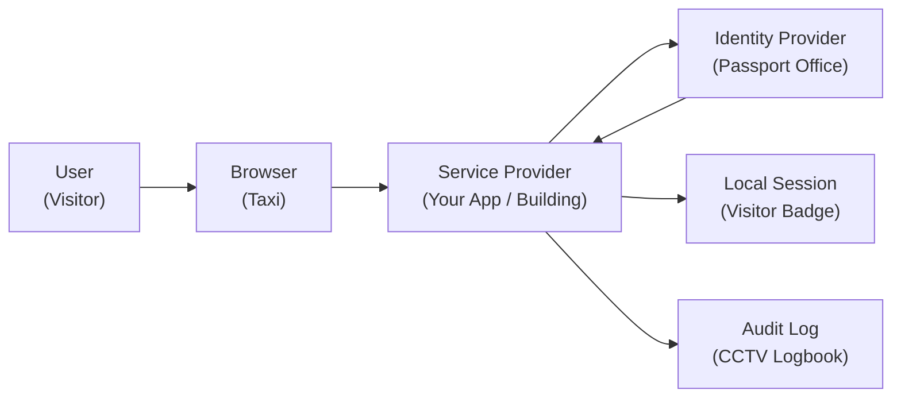

---

## 2. Protocol Atlas: Which Protocol Is Used for What?

SSO is not one protocol. It is a toolbox.

| Protocol / Mechanism | Main Purpose | Beginner Metaphor |
|---|---|---|
| OAuth 2.0 | Delegated authorization. Lets an app get access to resources. | A valet ticket that lets someone fetch one specific car, not own the whole garage. |
| OIDC | Authentication layer on OAuth 2.0. Proves who the user is. | A passport built on top of the valet ticket system. |
| SAML 2.0 | XML-based enterprise authentication and federation. | A formal stamped letter from a corporate office. |
| HTTPS / TLS | Protects traffic in transit. | An armored road between buildings. |
| mTLS | Both sides authenticate with certificates. | Two guards check each other's staff IDs before talking. |
| JWKS | OIDC public keys for JWT verification. | A public directory of official signature samples. |
| X.509 Certificate | Certificate used in SAML and TLS trust. | A notarized stamp certificate. |
| Front-Channel | Browser carries the message. | User carries a sealed envelope between offices. |
| Back-Channel | Server talks directly to server. | Two offices call each other on a private phone line. |
| WebSocket / Webhook | Real-time notification after session changes. | Security desk radios the floor staff immediately. |

---

## 3. The Whole SSO Lifecycle

Before we zoom into individual flows, here is the full lifecycle:

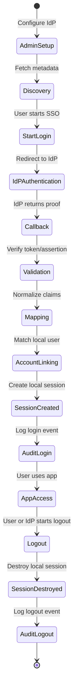

The beginner trick is to ask: "Which station am I at?" Most SSO terms are only scary when they float around without a station.

---

## 4. Admin Setup Flow: Preparing the Passport Desk

Before any user can log in, an administrator connects your app to the IdP.

Metaphor: before visitors arrive, the building manager must register which passport office is trusted, what stamps look like, and where to send visitors.

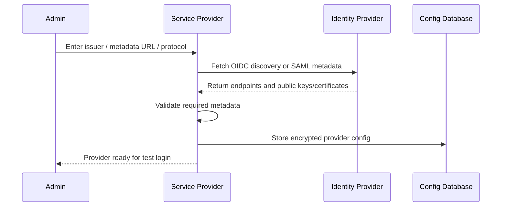

Important concepts:

| Concept | Purpose | Metaphor |
|---|---|---|
| Issuer URL | Identifies the IdP. | Passport office address. |
| Metadata URL | Where setup information is published. | Public notice board. |
| OIDC Discovery | Auto-fetches OIDC endpoints. | Asking the office for its official directory. |
| SAML Metadata | XML setup document for SAML. | A formal government registration document. |
| Client ID | Public identifier of your app at the IdP. | Building registration number. |
| Client Secret | Secret proving your app to the IdP. | Private office password. |
| Redirect URI | Where the IdP may send the user back. | Approved return gate. |
| Entity ID | SAML identifier for SP or IdP. | Legal company name in SAML world. |
| Certificate | Public proof used for signature validation. | Official stamp sample. |
| Envelope Encryption | Encrypting secrets in layers. | Putting valuables in a locked box, then locking the box key inside a vault. |

---

## 5. OIDC Login Flow: The Modern Passport Flow

OIDC is the common modern enterprise login protocol. It uses OAuth 2.0 plumbing, then adds identity proof through the **ID Token**.

Metaphor: your app sends the visitor to the passport office. The passport office checks the visitor and sends them back with a signed passport slip.

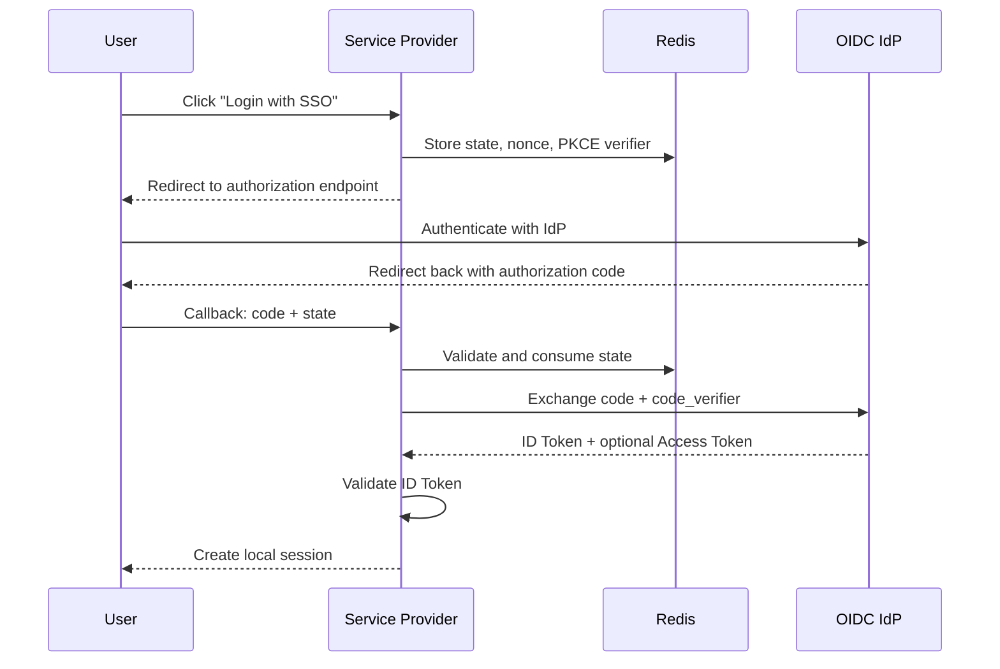

### Why the Authorization Code Exists

The **Authorization Code** is like a claim ticket from a coat check.

The IdP does not hand the expensive coat, the tokens, to the browser directly. Instead, it gives the browser a short-lived ticket. The browser brings the ticket back to your server. Your server exchanges that ticket directly with the IdP.

Why this design helps:

- The browser only sees a temporary code.
- The token exchange happens server-to-server.
- The code can expire quickly.
- The IdP can require the SP to prove itself with client secret and PKCE.

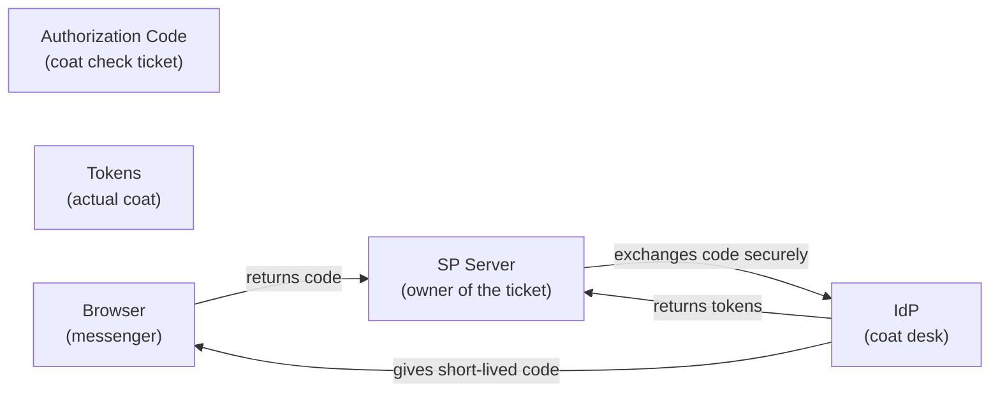

### Why PKCE Exists

PKCE is a proof-of-possession mechanism.

Metaphor: when you drop luggage at a counter, they give you a claim ticket. But a thief might photograph the ticket. PKCE adds a private phrase that only you know. Even if someone steals the ticket, they cannot collect the luggage without the private phrase.

| PKCE Part | Purpose | Metaphor |
|---|---|---|
| `code_verifier` | Random secret kept by the SP. | Private phrase kept in your pocket. |
| `code_challenge` | Hash of the verifier sent at login start. | Locked version of the phrase given to the counter. |
| Token request check | IdP checks verifier matches challenge. | Counter checks your private phrase before releasing luggage. |

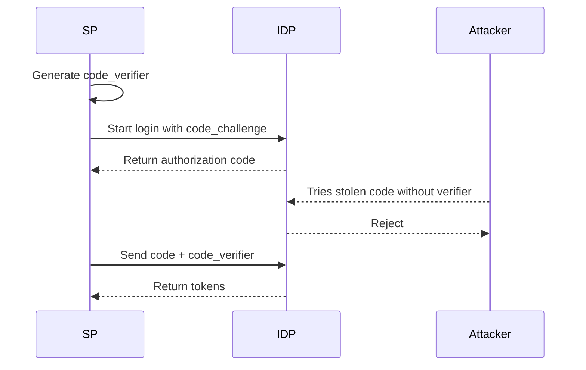

---

## 6. OAuth 2.0 Flow: Authorization Is Not Identity

OAuth 2.0 answers:

> Can this app access this resource?

OIDC answers:

> Who is this user?

Metaphor: OAuth 2.0 is a valet key. It may open the car enough to park it, but it does not prove the valet owns the car. OIDC adds the passport check.

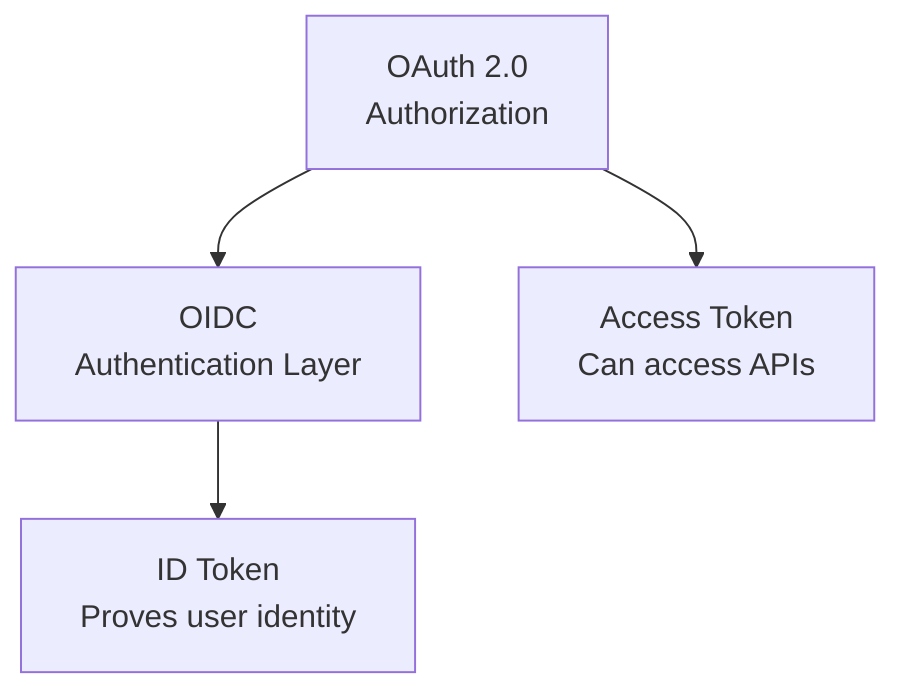

Beginner rule:

- Use **Access Token** to call APIs.
- Use **ID Token** to authenticate the user.
- Do not treat plain OAuth 2.0 as login unless you also have a reliable identity source like UserInfo and strict validation.

---

## 7. SAML SP-Initiated Login Flow: The Formal Letter Flow

SAML is older and XML-based, but still heavily used in enterprises.

Metaphor: instead of a compact digital passport card, SAML sends a formal signed letter. The letter is bulky, full of official wording, and must be checked carefully.

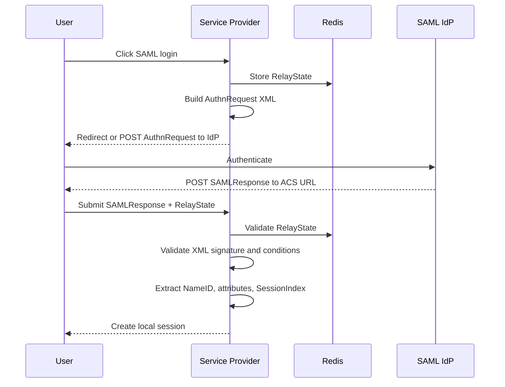

Important SAML pieces:

| SAML Concept | Purpose | Metaphor |
|---|---|---|
| `AuthnRequest` | SP asks IdP to authenticate user. | Building sends an official visitor request. |
| `RelayState` | Random state connecting request to response. | Claim number on the request envelope. |
| ACS URL | Assertion Consumer Service callback URL. | Official mailroom return address. |
| `SAMLResponse` | IdP response containing assertion. | Signed official letter. |
| SAML Assertion | Identity proof inside response. | The actual stamped authorization letter. |
| XML Signature | Cryptographic signature over XML. | Official wax seal. |
| `NameID` | User identifier. | Name on the formal letter. |
| `SessionIndex` | IdP session reference. | Visitor visit number for later logout. |

---

## 8. IdP-Initiated Login Flow: The Visitor Arrives with a Letter

In SP-initiated login, the user starts at your app.

In IdP-initiated login, the user starts at the IdP portal, then clicks your app tile.

Metaphor: instead of your building sending a visitor to the passport office, the passport office sends the visitor to your building with a letter already prepared.

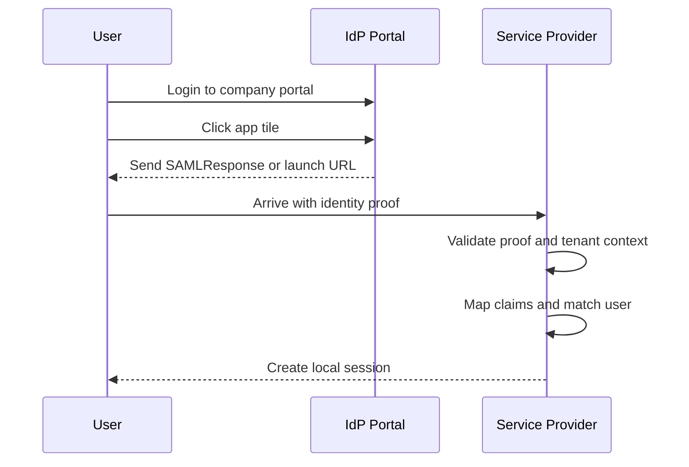

Security warning for beginners:

IdP-initiated login is convenient, but it can be harder to bind to an original `state` created by the SP. Treat it carefully. Always validate issuer, audience, signature, tenant, and replay protections.

---

## 9. Callback Validation Flow: Trust, but Check the Passport

Callback validation is where many SSO vulnerabilities happen.

Metaphor: someone returns from the passport office holding a document. You do not let them in just because the paper looks official. You check the stamp, expiry date, recipient, issuing office, and whether the document has been reused.

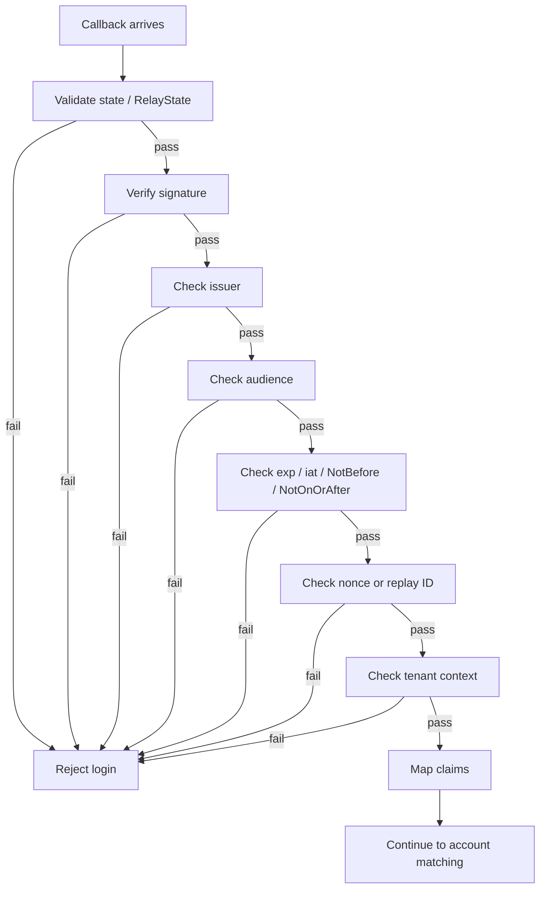

Validation concepts and purpose:

| Concept | Used In | Purpose |
|---|---|---|
| `state` | OAuth/OIDC | Prevents CSRF and links request to callback. |
| `RelayState` | SAML | SAML version of request/response linking. |
| `nonce` | OIDC | Ensures the ID Token belongs to this login attempt. |
| Signature | OIDC/SAML | Proves the IdP issued the token/assertion. |
| `iss` | OIDC | Confirms correct issuer. |
| `aud` | OIDC/SAML | Confirms token/assertion is meant for this app. |
| `exp` / `iat` | OIDC | Enforces token freshness. |
| `NotBefore` / `NotOnOrAfter` | SAML | Enforces assertion time window. |
| `jti` | JWT logout tokens | Detects replay. |
| `kid` | OIDC JWT | Selects the correct JWKS key. |

---

## 10. Attribute Mapping Flow: Translating Different Dialects

Every IdP speaks a slightly different dialect.

Metaphor: one visitor document says "surname", another says "family name", another says "last name". Your building needs one standard field.

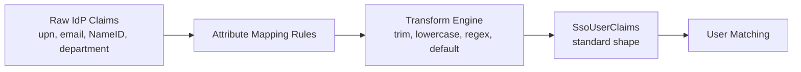

Example mapping:

```typescript
const mappedClaims = {
  externalUserId: claims.sub ?? claims.NameID,
  email: normalizeEmail(claims.email ?? claims.upn),
  displayName: claims.name,
  department: claims.department ?? "unknown",
};
```

Purpose:

- Hide IdP-specific weirdness from the rest of your app.
- Keep user matching consistent.
- Let admins configure mappings without code changes.
- Avoid hardcoding one customer's identity format into your platform.

---

## 11. Account Linking Flow: Matching the Visitor to a Local Employee Record

After validation and mapping, you still need to answer:

> Which local account should this identity access?

Metaphor: a passport proves someone is Alice Wong, but your building still needs to find Alice Wong's employee record and badge permissions.

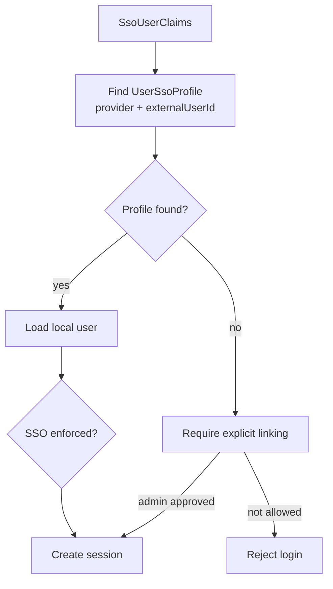

Why not just create accounts automatically?

JIT provisioning is like giving a building badge to anyone who arrives with a valid-looking letter from an accepted office. Sometimes that is desired. But in strict enterprise systems, account creation should be explicit, reviewed, and auditable.

---

## 12. Session Creation Flow: Turning Proof into Access

The IdP proof should not be revalidated on every click. After login, your app creates a local session.

Metaphor: after the front desk checks your passport, they give you a visitor badge. You show the badge inside the building instead of showing your passport at every door.

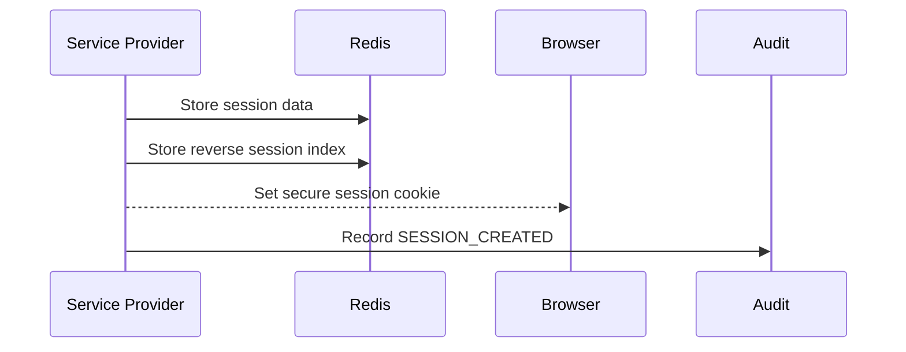

Important session ideas:

| Concept | Purpose | Metaphor |
|---|---|---|
| Session Cookie | Browser holds session reference. | Badge number. |
| Redis Session | Server-side session data. | Badge record at front desk. |
| Reverse Session Index | Map IdP session to local sessions. | Lookup table for all badges from one passport visit. |
| TTL | Automatic expiry. | Visitor badge expires at closing time. |
| Secure / HttpOnly Cookie | Cookie protection. | Badge sealed in a holder the visitor cannot rewrite. |

---

## 13. SP-Initiated Logout Flow: User Leaves Through Your Front Door

SP-initiated logout starts when the user clicks logout in your app.

Metaphor: the visitor returns the badge to your front desk, and your front desk also tells the passport office that the visit is over.

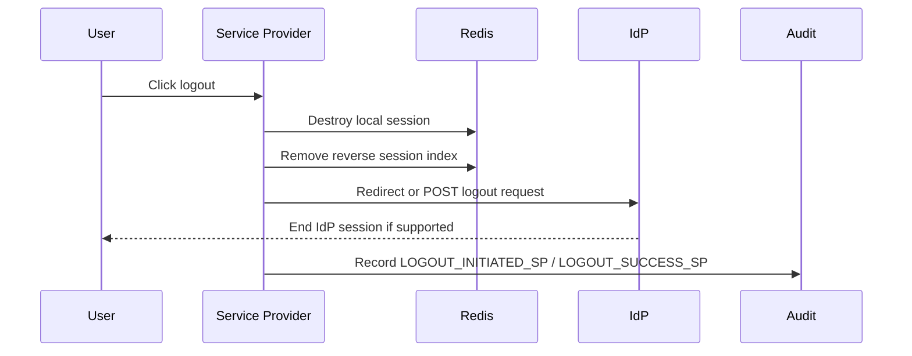

Protocol differences:

| Protocol | Logout Mechanism | Notes |
|---|---|---|
| OIDC | `end_session_endpoint` with `id_token_hint` | Browser often redirects to IdP logout endpoint. |
| SAML | `LogoutRequest` with `NameID` and `SessionIndex` | Requires careful signing and XML validation. |
| OAuth 2.0 only | No universal logout standard | Usually app-specific. |

---

## 14. IdP-Initiated Front-Channel Logout: Browser Carries the Notice

Front-channel logout means the IdP sends logout messages through the user's browser.

Metaphor: the passport office gives the visitor a note and says, "Please bring this to the building front desk so they cancel your badge."

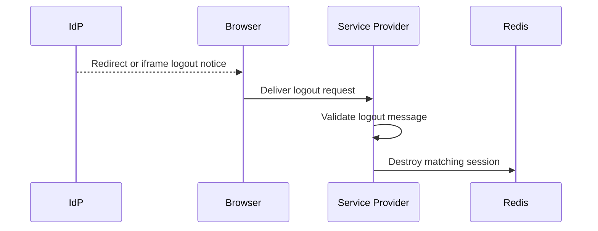

Pros:

- Simple to understand.
- Works with browser redirects.

Cons:

- Fails if the browser is closed.
- Can be blocked by browser privacy features.
- Harder for multi-device logout.

---

## 15. IdP-Initiated Back-Channel Logout: The Private Phone Call

Back-Channel Logout (BCL) is server-to-server logout.

Metaphor: the passport office does not ask the visitor to deliver the cancellation note. It directly calls the building security desk and says, "Cancel this person's badge now."

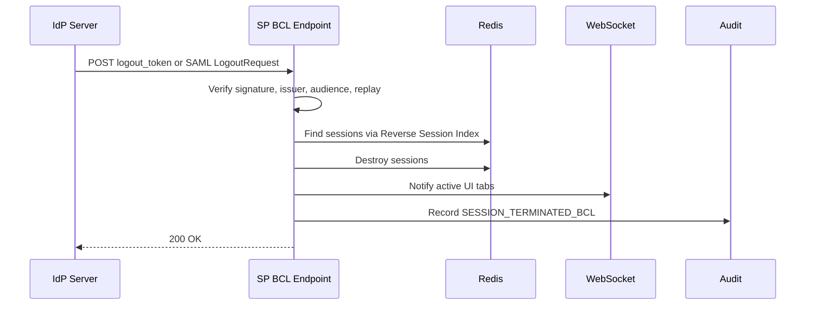

Why BCL is powerful:

- Works even when the user's browser is closed.
- Supports admin session revocation.
- Better for multi-device session cleanup.
- Easier to monitor as a backend endpoint.

---

## 16. Certificate and Key Rotation Flow: Changing the Official Stamp

Keys and certificates expire or get compromised.

Metaphor: the passport office changes its official stamp. Your building must learn the new stamp before visitors arrive, but still accept the old stamp during a grace period.

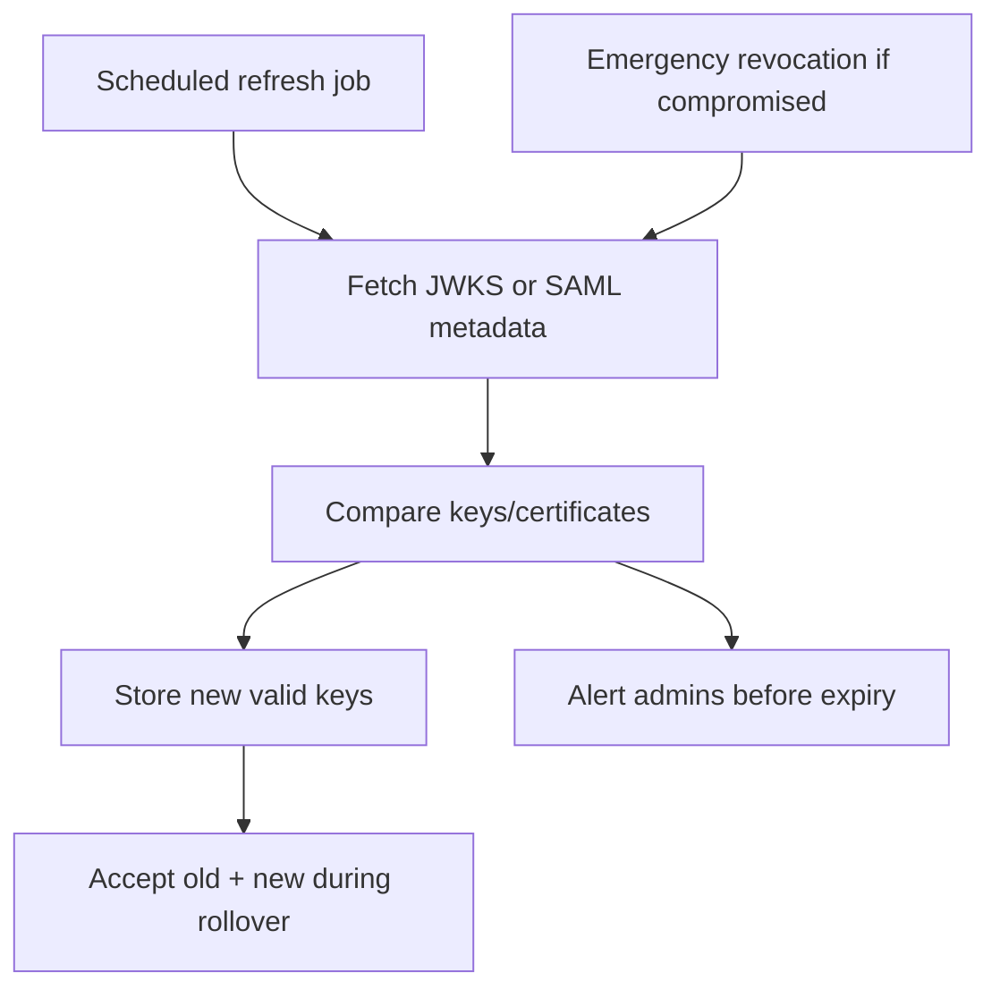

Key concepts:

| Concept | Purpose | Metaphor |
|---|---|---|
| JWKS Refresh | Gets new OIDC public keys. | Checking the latest official stamp directory. |
| SAML Certificate Refresh | Gets new SAML signing certificates. | Downloading the new stamp sample from the office. |
| Rollover Window | Accepts both old and new keys temporarily. | Both old and new stamps are valid this week. |
| Emergency Revocation | Stop trusting a compromised key now. | Security announces: "Do not accept the old stamp anymore." |
| Expiry Alert | Warns before certificate becomes invalid. | Calendar reminder before the stamp license expires. |

---

## 17. Multi-Tenant SSO Flow: Many Companies, One Building Complex

Multi-tenant SSO means one SaaS platform serves many companies.

Metaphor: imagine one office tower with many companies inside. A visitor for Company A must never be routed to Company B's front desk.

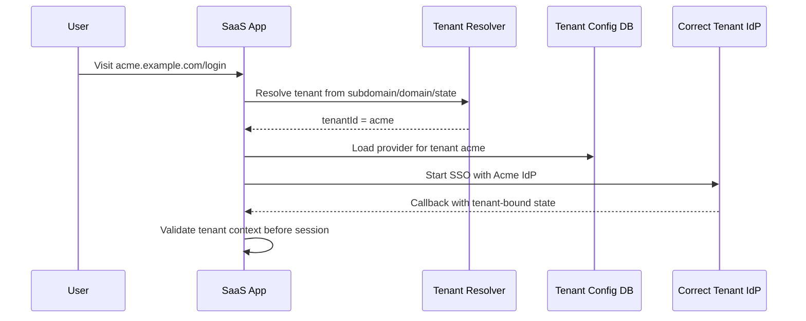

Important safety rules:

- Resolve tenant before choosing an IdP.
- Include tenant context in `state`.
- Scope provider lookup by tenant ID.
- Scope JWKS cache by tenant and provider.
- Validate callback tenant matches the original login.
- Record tenant ID in audit logs.

---

## 18. Audit Flow: Writing the CCTV Logbook

Audit logging is not just debugging. It is evidence.

Metaphor: if a security incident happens, the audit log is the CCTV footage and visitor logbook. Without it, everyone is guessing.

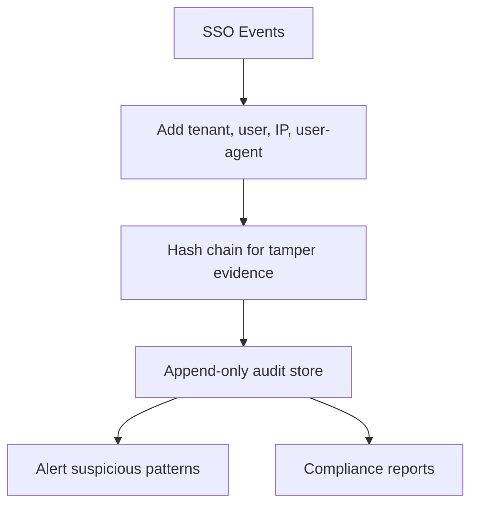

Events worth logging:

| Event | Why It Matters |
|---|---|
| `SSO_LOGIN_INITIATED` | Shows when login started. |
| `SSO_LOGIN_SUCCESS` | Shows who got access. |
| `SSO_LOGIN_FAILED` | Helps detect attacks and config issues. |
| `TOKEN_VALIDATION_FAILED` | Indicates signature, issuer, audience, or expiry problems. |
| `PROVIDER_UPDATED` | Tracks admin config changes. |
| `CERTIFICATE_ROTATED` | Tracks key lifecycle changes. |
| `SESSION_TERMINATED_BCL` | Proves IdP-initiated logout worked. |
| `CROSS_TENANT_ATTEMPT` | Critical multi-tenant security signal. |

---

## 19. Flow Cheat Sheet for Newbies

| Flow | Trigger | Main Protocols | Main Security Checks | Beginner Metaphor |
|---|---|---|---|---|
| Admin setup | Admin configures IdP | OIDC Discovery, SAML Metadata, HTTPS | Metadata validity, encrypted secrets | Register trusted passport office. |
| OIDC login | User starts login at SP | OIDC, OAuth 2.0, HTTPS | `state`, PKCE, ID Token signature, `iss`, `aud`, `nonce` | Visitor gets passport slip. |
| OAuth code exchange | SP exchanges code | OAuth 2.0, HTTPS | Client secret, PKCE, redirect URI | Coat ticket exchanged at counter. |
| SAML login | User starts SAML login | SAML 2.0, HTTP Redirect/POST, HTTPS | `RelayState`, XML signature, audience, time window | Formal stamped letter. |
| IdP-initiated login | User starts at IdP portal | Usually SAML, sometimes OIDC launch patterns | Signature, audience, issuer, tenant, replay | Visitor arrives with a prewritten letter. |
| Attribute mapping | After proof validation | Internal app logic | Required fields, transforms, admin rules | Translate dialects into one form. |
| Account linking | After mapping | Internal app logic | Stable external ID, tenant/provider match | Match passport to employee record. |
| Session creation | After user match | Cookie, Redis, HTTPS | Secure cookie, TTL, reverse session index | Issue visitor badge. |
| SP logout | User clicks logout | OIDC logout, SAML SLO | Session lookup, signed logout where needed | Visitor returns badge. |
| Front-channel logout | IdP uses browser | Browser redirects/iframes | Validate logout request | Visitor carries cancellation note. |
| Back-channel logout | IdP calls SP server | OIDC BCL, SAML SOAP/POST patterns | Signature, replay, session index | Passport office calls security desk. |
| Key rotation | Scheduled or emergency | JWKS, SAML Metadata, X.509 | Expiry, fingerprint, rollover | Passport office changes stamp. |
| Audit reporting | Every important action | Internal logging/storage | Append-only, tamper-evident, retention | CCTV logbook. |

---

## 20. Final Mental Model

If SSO feels complicated, do not memorize every acronym first. Memorize the story:

1. **Setup:** decide which passport offices your building trusts.
2. **Start login:** send the visitor to the right office with a tracking number.
3. **Authenticate:** the office checks the visitor.
4. **Return proof:** the visitor comes back with a code, token, or assertion.
5. **Validate:** check stamp, expiry, recipient, office, and replay markers.
6. **Map:** translate the document fields into your app's language.
7. **Match:** find the local account.
8. **Issue session:** give the visitor a badge.
9. **Logout:** collect or cancel the badge.
10. **Rotate keys:** keep stamp samples fresh.
11. **Audit:** write down what happened.

Once you can tell that story, PKCE, Authorization Code, JWKS, SAML Assertion, RelayState, SLO, and BCL stop feeling like random spells. They become tools at specific stations in the journey.

---
---

## 導言：SSO 係一套旅行系統，唔係一粒 Button

新手 Programmer 聽到 "implement SSO"，好容易以為只係一粒 magic button：

> Click login，去 Microsoft，返嚟，done。

真實 enterprise SSO 其實更似一個國際機場。有 passport、boarding pass、gate、security check、transfer counter、customs、lost luggage desk、CCTV records。每一件事存在，都係因為以前有人試過偷入、破壞 trust，或者搞到 operations 一團亂。

呢篇係比新手嘅 tutorial，集中講 **SSO 可能涉及嘅所有主要 flows**。我哋會講 protocols、每個 concept 點解存在，同埋啲 pieces 點樣郁：

- OAuth 2.0 Authorization Code Flow
- OpenID Connect (OIDC) login
- SAML 2.0 login
- SP-initiated login
- IdP-initiated login
- Callback validation
- PKCE 同 authorization code exchange
- Attribute mapping 同 account linking
- Session creation
- SP-initiated Single Logout (SLO)
- IdP-initiated Front-Channel Logout
- IdP-initiated Back-Channel Logout (BCL)
- JWKS 同 certificate rotation
- Multi-tenant SSO routing
- Audit logging 同 compliance evidence

細細個命名提醒：好多 developer 會口語叫 "authentication code"，但喺 OAuth/OIDC 正式名係 **Authorization Code**。佢用喺 authentication flow 入面，所以混淆係好正常。

---

## 1. 主要角色：呢套戲有邊個？

可以將 enterprise SSO 想像成一棟公司大廈嘅 front desk。

| SSO Concept | 比喻 | 佢做咩 |
|---|---|---|
| User | 訪客 | 想入你個 application。 |
| Service Provider (SP) | 你棟大廈 | 你個 application，要決定俾唔俾 user 入。 |
| Identity Provider (IdP) | Passport office / 公司 security desk | Authenticate user，然後 issue trusted proof。 |
| Browser | 大廈之間嘅的士 | 負責載 redirects 同 messages 來回 SP / IdP。 |
| Token / Assertion | Passport / 蓋咗印嘅入場信 | IdP authenticate 咗 user 嘅 proof。 |
| Local Session | 訪客證 | Login 後俾 user 喺你 app 入面活動。 |
| Audit Log | CCTV logbook | 記低發生過咩事，方便 investigation 同 compliance。 |


---

## 2. Protocol Atlas：邊個 Protocol 用嚟做咩？

SSO 唔係單一 protocol。佢係一箱工具。

| Protocol / Mechanism | 主要用途 | 新手比喻 |
|---|---|---|
| OAuth 2.0 | Delegated authorization，俾 app access resources。 | Valet ticket，只准人攞某架車，唔代表擁有成個車房。 |
| OIDC | 起喺 OAuth 2.0 上面嘅 authentication layer。 | 喺 valet ticket system 上面加一張 passport。 |
| SAML 2.0 | XML-based enterprise authentication/federation。 | 公司正式發出嘅蓋印公文。 |
| HTTPS / TLS | 保護 traffic in transit。 | 大廈之間嘅裝甲道路。 |
| mTLS | 雙方都用 certificates authenticate。 | 兩邊 guard 互相 check staff ID 先傾。 |
| JWKS | OIDC public keys，用嚟 verify JWT。 | 官方簽名樣本目錄。 |
| X.509 Certificate | SAML/TLS trust 用嘅 certificate。 | 經公證嘅印章證書。 |
| Front-Channel | Browser 幫手帶 message。 | User 親手拎 sealed envelope 去另一個 office。 |
| Back-Channel | Server 直接同 server 傾。 | 兩個 office 用私人電話線直接通話。 |
| WebSocket / Webhook | Session change 後嘅 real-time notification。 | Security desk 即刻用對講機通知樓層職員。 |

---

## 3. 完整 SSO Lifecycle

入細節之前，先睇成個 lifecycle：

```mermaid
stateDiagram-v2
    [*] --> AdminSetup: Configure IdP
    AdminSetup --> Discovery: Fetch metadata
    Discovery --> StartLogin: User starts SSO
    StartLogin --> IdPAuthentication: Redirect to IdP
    IdPAuthentication --> Callback: IdP returns proof
    Callback --> Validation: Verify token/assertion
    Validation --> Mapping: Normalize claims
    Mapping --> AccountLinking: Match local user
    AccountLinking --> SessionCreated: Create local session
    SessionCreated --> AuditLogin: Log login event
    AuditLogin --> AppAccess: User uses app
    AppAccess --> Logout: User or IdP starts logout
    Logout --> SessionDestroyed: Destroy local session
    SessionDestroyed --> AuditLogout: Log logout event
    AuditLogout --> [*]
```

新手技巧係問自己：「我而家喺邊個站？」好多 SSO terms 可怕，只係因為佢哋冇站位，喺你腦入面飄嚟飄去。

---

## 4. Admin Setup Flow：預先準備 Passport Desk

任何 user login 前，admin 要先將你個 app 接駁去 IdP。

比喻：訪客到之前，大廈經理要先登記邊個 passport office 可信、印章樣係點、訪客要送去邊度。

```mermaid
sequenceDiagram
    participant Admin
    participant SP as Service Provider
    participant IDP as Identity Provider
    participant DB as Config Database

    Admin->>SP: Enter issuer / metadata URL / protocol
    SP->>IDP: Fetch OIDC discovery or SAML metadata
    IDP-->>SP: Return endpoints and public keys/certificates
    SP->>SP: Validate required metadata
    SP->>DB: Store encrypted provider config
    SP-->>Admin: Provider ready for test login
```

重要 concepts：

| Concept | 用途 | 比喻 |
|---|---|---|
| Issuer URL | 識別 IdP。 | Passport office 地址。 |
| Metadata URL | IdP publish setup information 嘅地方。 | 公告板。 |
| OIDC Discovery | 自動 fetch OIDC endpoints。 | 問 office 攞官方目錄。 |
| SAML Metadata | SAML setup XML document。 | 正式政府登記文件。 |
| Client ID | 你個 app 喺 IdP 嘅 public identifier。 | 大廈登記號碼。 |
| Client Secret | 證明你個 app 身份嘅 secret。 | 私人 office password。 |
| Redirect URI | IdP 可以送 user 返嚟嘅 callback URL。 | 核准回程 gate。 |
| Entity ID | SAML 入面 SP/IdP identifier。 | SAML 世界嘅法定公司名。 |
| Certificate | Signature validation 用嘅 public proof。 | 官方印章樣本。 |
| Envelope Encryption | 分層 encrypt secrets。 | 將貴重物品放入鎖盒，再將鎖盒 key 放入保險庫。 |

---

## 5. OIDC Login Flow：現代 Passport Flow

OIDC 係常見 modern enterprise login protocol。佢用 OAuth 2.0 做底，再用 **ID Token** 加 identity proof。

比喻：你個 app 送訪客去 passport office。Passport office check 完訪客，就送返一張 signed passport slip。

```mermaid
sequenceDiagram
    participant U as User
    participant SP as Service Provider
    participant R as Redis
    participant IDP as OIDC IdP

    U->>SP: Click "Login with SSO"
    SP->>R: Store state, nonce, PKCE verifier
    SP-->>U: Redirect to authorization endpoint
    U->>IDP: Authenticate with IdP
    IDP-->>U: Redirect back with authorization code
    U->>SP: Callback: code + state
    SP->>R: Validate and consume state
    SP->>IDP: Exchange code + code_verifier
    IDP-->>SP: ID Token + optional Access Token
    SP->>SP: Validate ID Token
    SP-->>U: Create local session
```

### Authorization Code 點解存在

**Authorization Code** 好似衣帽間嘅 claim ticket。

IdP 唔會直接將昂貴嘅外套，也就係 tokens，交俾 browser。佢先俾 browser 一張短命 ticket。Browser 帶 ticket 返你 server。你 server 再直接同 IdP exchange。

呢個 design 點解有用：

- Browser 只見到 temporary code。
- Token exchange 係 server-to-server。
- Code 可以好快 expire。
- IdP 可以要求 SP 用 client secret 同 PKCE 證明自己。

```mermaid
flowchart LR
    CODE["Authorization Code<br/>(coat check ticket)"]
    TOKEN["Tokens<br/>(actual coat)"]
    BROWSER["Browser<br/>(messenger)"]
    SERVER["SP Server<br/>(owner of the ticket)"]
    IDP["IdP<br/>(coat desk)"]

    IDP -->|"gives short-lived code"| BROWSER
    BROWSER -->|"returns code"| SERVER
    SERVER -->|"exchanges code securely"| IDP
    IDP -->|"returns tokens"| SERVER
```

### PKCE 點解存在

PKCE 係 proof-of-possession mechanism。

比喻：你寄存行李時，counter 俾你 claim ticket。但小偷可能影低張 ticket。PKCE 加多一句只有你知嘅 private phrase。就算有人偷咗 ticket，冇 private phrase 都攞唔到行李。

| PKCE Part | 用途 | 比喻 |
|---|---|---|
| `code_verifier` | SP keep 住嘅 random secret。 | 放喺你袋入面嘅 private phrase。 |
| `code_challenge` | Verifier hash 出嚟，login 開始時送去 IdP。 | 交俾 counter 嘅 locked phrase。 |
| Token request check | IdP check verifier match challenge。 | Counter check 你講得出 private phrase 先放行李。 |

```mermaid
sequenceDiagram
    participant SP
    participant IDP
    participant Attacker

    SP->>SP: Generate code_verifier
    SP->>IDP: Start login with code_challenge
    IDP-->>SP: Return authorization code
    Attacker-->>IDP: Tries stolen code without verifier
    IDP-->>Attacker: Reject
    SP->>IDP: Send code + code_verifier
    IDP-->>SP: Return tokens
```

---

## 6. OAuth 2.0 Flow：Authorization 唔等於 Identity

OAuth 2.0 回答：

> 呢個 app 可唔可以 access 呢個 resource？

OIDC 回答：

> 呢個 user 係邊個？

比喻：OAuth 2.0 係 valet key。佢可以俾人幫你泊車，但唔代表 valet 擁有架車。OIDC 就係加埋 passport check。

```mermaid
flowchart TD
    OAUTH["OAuth 2.0<br/>Authorization"]
    OIDC["OIDC<br/>Authentication Layer"]
    ACCESS["Access Token<br/>Can access APIs"]
    IDTOKEN["ID Token<br/>Proves user identity"]

    OAUTH --> ACCESS
    OAUTH --> OIDC
    OIDC --> IDTOKEN
```

新手規則：

- 用 **Access Token** call APIs。
- 用 **ID Token** authenticate user。
- 唔好將 plain OAuth 2.0 當 login，除非你另外有可靠 identity source，例如 UserInfo，而且有嚴格 validation。

---

## 7. SAML SP-Initiated Login Flow：正式公文 Flow

SAML 比較舊，XML-based，但 enterprise 仲好常用。

比喻：佢唔係一張細細張 digital passport card，而係一封正式 signed letter。好厚、好多 official wording，而且一定要好小心 check。

```mermaid
sequenceDiagram
    participant U as User
    participant SP as Service Provider
    participant R as Redis
    participant IDP as SAML IdP

    U->>SP: Click SAML login
    SP->>R: Store RelayState
    SP->>SP: Build AuthnRequest XML
    SP-->>U: Redirect or POST AuthnRequest to IdP
    U->>IDP: Authenticate
    IDP-->>U: POST SAMLResponse to ACS URL
    U->>SP: Submit SAMLResponse + RelayState
    SP->>R: Validate RelayState
    SP->>SP: Validate XML signature and conditions
    SP->>SP: Extract NameID, attributes, SessionIndex
    SP-->>U: Create local session
```

重要 SAML pieces：

| SAML Concept | 用途 | 比喻 |
|---|---|---|
| `AuthnRequest` | SP 要求 IdP authenticate user。 | 大廈發出正式訪客申請。 |
| `RelayState` | 連接 request 同 response 嘅 random state。 | 申請信封上嘅 claim number。 |
| ACS URL | Assertion Consumer Service callback URL。 | 官方 mailroom return address。 |
| `SAMLResponse` | IdP response，包含 assertion。 | Signed official letter。 |
| SAML Assertion | Response 入面嘅 identity proof。 | 真正蓋咗印嘅授權信。 |
| XML Signature | XML 上面嘅 cryptographic signature。 | 官方封蠟。 |
| `NameID` | User identifier。 | 公文上嘅人名。 |
| `SessionIndex` | IdP session reference。 | 之後 logout 用嘅訪客編號。 |

---

## 8. IdP-Initiated Login Flow：訪客拎住信自己嚟

SP-initiated login 係 user 由你個 app 開始。

IdP-initiated login 係 user 先入 IdP portal，再 click 你個 app tile。

比喻：唔係你棟大廈叫訪客去 passport office，而係 passport office 已經準備好封信，直接送訪客去你棟大廈。

```mermaid
sequenceDiagram
    participant U as User
    participant IDP as IdP Portal
    participant SP as Service Provider

    U->>IDP: Login to company portal
    U->>IDP: Click app tile
    IDP-->>U: Send SAMLResponse or launch URL
    U->>SP: Arrive with identity proof
    SP->>SP: Validate proof and tenant context
    SP->>SP: Map claims and match user
    SP-->>U: Create local session
```

新手 security warning：

IdP-initiated login 好方便，但因為未必有 SP 一開始 create 嘅 `state`，所以 request binding 會難啲。一定要 validate issuer、audience、signature、tenant、replay protections。

---

## 9. Callback Validation Flow：信任，但要 Check Passport

好多 SSO vulnerability 都發生喺 callback validation。

比喻：有人拎住文件由 passport office 返嚟。你唔會因為張紙睇落 official 就即刻放人入。你要 check 印章、到期日、收件人、簽發 office，同埋份文件係咪被重用。

```mermaid
flowchart TD
    CALLBACK["Callback arrives"]
    STATE["Validate state / RelayState"]
    SIG["Verify signature"]
    ISS["Check issuer"]
    AUD["Check audience"]
    TIME["Check exp / iat / NotBefore / NotOnOrAfter"]
    NONCE["Check nonce or replay ID"]
    TENANT["Check tenant context"]
    MAP["Map claims"]
    REJECT["Reject login"]
    ACCEPT["Continue to account matching"]

    CALLBACK --> STATE
    STATE -->|fail| REJECT
    STATE -->|pass| SIG
    SIG -->|fail| REJECT
    SIG -->|pass| ISS
    ISS -->|fail| REJECT
    ISS -->|pass| AUD
    AUD -->|fail| REJECT
    AUD -->|pass| TIME
    TIME -->|fail| REJECT
    TIME -->|pass| NONCE
    NONCE -->|fail| REJECT
    NONCE -->|pass| TENANT
    TENANT -->|fail| REJECT
    TENANT -->|pass| MAP
    MAP --> ACCEPT
```

Validation concepts 同用途：

| Concept | 用喺邊 | 用途 |
|---|---|---|
| `state` | OAuth/OIDC | 防 CSRF，將 request 同 callback link 返埋。 |
| `RelayState` | SAML | SAML 版 request/response linking。 |
| `nonce` | OIDC | 確保 ID Token 屬於今次 login attempt。 |
| Signature | OIDC/SAML | 證明 token/assertion 由 IdP issue。 |
| `iss` | OIDC | 確認 issuer 正確。 |
| `aud` | OIDC/SAML | 確認 token/assertion 係俾你個 app。 |
| `exp` / `iat` | OIDC | 控制 token freshness。 |
| `NotBefore` / `NotOnOrAfter` | SAML | 控制 assertion time window。 |
| `jti` | JWT logout tokens | Detect replay。 |
| `kid` | OIDC JWT | 揀正確 JWKS key。 |

---

## 10. Attribute Mapping Flow：翻譯唔同方言

每個 IdP 都講少少唔同嘅方言。

比喻：一份訪客文件寫 "surname"，另一份寫 "family name"，又有一份寫 "last name"。你棟大廈需要一個 standard field。

```mermaid
flowchart LR
    RAW["Raw IdP Claims<br/>upn, email, NameID, department"]
    MAP["Attribute Mapping Rules"]
    TRANSFORM["Transform Engine<br/>trim, lowercase, regex, default"]
    NORMAL["SsoUserClaims<br/>standard shape"]
    MATCH["User Matching"]

    RAW --> MAP --> TRANSFORM --> NORMAL --> MATCH
```

Example mapping：

```typescript
const mappedClaims = {
  externalUserId: claims.sub ?? claims.NameID,
  email: normalizeEmail(claims.email ?? claims.upn),
  displayName: claims.name,
  department: claims.department ?? "unknown",
};
```

用途：

- 將 IdP-specific weirdness 隱藏喺 app 其他地方之外。
- 令 user matching consistent。
- Admin 可以 configure mappings，唔使改 code。
- 避免將某個 customer 嘅 identity format hardcode 入 platform。

---

## 11. Account Linking Flow：將訪客 Match 去 Local Employee Record

Validation 同 mapping 後，你仍然要答：

> 呢個 identity 應該 access 邊個 local account？

比喻：passport 證明佢係 Alice Wong，但你棟大廈仲要搵 Alice Wong 嘅 employee record 同 badge permissions。

```mermaid
flowchart TD
    CLAIMS["SsoUserClaims"]
    PROFILE["Find UserSsoProfile<br/>provider + externalUserId"]
    FOUND{"Profile found?"}
    LOCAL["Load local user"]
    ENFORCED{"SSO enforced?"}
    SESSION["Create session"]
    LINK["Require explicit linking"]
    REJECT["Reject login"]

    CLAIMS --> PROFILE --> FOUND
    FOUND -->|yes| LOCAL --> ENFORCED --> SESSION
    FOUND -->|no| LINK
    LINK -->|admin approved| SESSION
    LINK -->|not allowed| REJECT
```

點解唔直接自動開 account？

JIT provisioning 就似任何人拎住一封 valid-looking letter，由 accepted office 過嚟，你就即刻派 building badge。有啲場景係想咁做。但嚴格 enterprise systems 入面，account creation 應該 explicit、reviewed、auditable。

---

## 12. Session Creation Flow：將 Proof 變成 Access

IdP proof 唔應該每 click 一頁就 verify 一次。Login 後，你個 app 會 create local session。

比喻：front desk check 完 passport 後，就派訪客證。之後喺大廈入面行，每道門睇訪客證，唔使每次睇 passport。

```mermaid
sequenceDiagram
    participant SP as Service Provider
    participant Redis
    participant Browser
    participant Audit

    SP->>Redis: Store session data
    SP->>Redis: Store reverse session index
    SP-->>Browser: Set secure session cookie
    SP->>Audit: Record SESSION_CREATED
```

重要 session ideas：

| Concept | 用途 | 比喻 |
|---|---|---|
| Session Cookie | Browser hold session reference。 | 訪客證號碼。 |
| Redis Session | Server-side session data。 | Front desk 嘅 badge record。 |
| Reverse Session Index | Map IdP session 去 local sessions。 | 一次 passport visit 對應所有 badges 嘅 lookup table。 |
| TTL | Automatic expiry。 | 訪客證收工後過期。 |
| Secure / HttpOnly Cookie | Cookie protection。 | 訪客唔可以自己改嘅 sealed badge holder。 |

---

## 13. SP-Initiated Logout Flow：User 由你正門離開

SP-initiated logout 由 user 喺你 app click logout 開始。

比喻：訪客將 badge 還俾你 front desk，而你 front desk 亦通知 passport office 今次 visit 完咗。

```mermaid
sequenceDiagram
    participant U as User
    participant SP as Service Provider
    participant R as Redis
    participant IDP as IdP
    participant A as Audit

    U->>SP: Click logout
    SP->>R: Destroy local session
    SP->>R: Remove reverse session index
    SP->>IDP: Redirect or POST logout request
    IDP-->>U: End IdP session if supported
    SP->>A: Record LOGOUT_INITIATED_SP / LOGOUT_SUCCESS_SP
```

Protocol differences：

| Protocol | Logout Mechanism | Notes |
|---|---|---|
| OIDC | `end_session_endpoint` with `id_token_hint` | Browser 通常 redirect 去 IdP logout endpoint。 |
| SAML | `LogoutRequest` with `NameID` and `SessionIndex` | 需要小心 signing 同 XML validation。 |
| OAuth 2.0 only | 冇 universal logout standard | 通常係 app-specific。 |

---

## 14. IdP-Initiated Front-Channel Logout：Browser 幫手帶 Notice

Front-channel logout 即係 IdP 經 user browser send logout messages。

比喻：passport office 俾訪客一張 note，叫佢：「拎呢張去大廈 front desk，叫佢取消你張 badge。」

```mermaid
sequenceDiagram
    participant IDP as IdP
    participant Browser
    participant SP as Service Provider
    participant Redis

    IDP-->>Browser: Redirect or iframe logout notice
    Browser->>SP: Deliver logout request
    SP->>SP: Validate logout message
    SP->>Redis: Destroy matching session
```

優點：

- 容易理解。
- 配合 browser redirect。

缺點：

- Browser 關咗就 fail。
- 可能被 browser privacy features 擋。
- Multi-device logout 比較難。

---

## 15. IdP-Initiated Back-Channel Logout：私人電話線

Back-Channel Logout (BCL) 係 server-to-server logout。

比喻：passport office 唔叫訪客帶 cancellation note。佢直接打電話去大廈 security desk：「即刻取消呢個人嘅 badge。」

```mermaid
sequenceDiagram
    participant IDP as IdP Server
    participant SP as SP BCL Endpoint
    participant R as Redis
    participant WS as WebSocket
    participant A as Audit

    IDP->>SP: POST logout_token or SAML LogoutRequest
    SP->>SP: Verify signature, issuer, audience, replay
    SP->>R: Find sessions via Reverse Session Index
    SP->>R: Destroy sessions
    SP->>WS: Notify active UI tabs
    SP->>A: Record SESSION_TERMINATED_BCL
    SP-->>IDP: 200 OK
```

BCL 點解勁：

- User browser 關咗都 work。
- 支援 admin session revocation。
- 更適合 multi-device session cleanup。
- Backend endpoint 容易 monitor。

---

## 16. Certificate and Key Rotation Flow：換官方印章

Keys 同 certificates 會 expire，亦可能 compromised。

比喻：passport office 換咗官方印章。你棟大廈要喺訪客嚟之前學識新印章，但 transition period 可能要同時接受舊印同新印。

```mermaid
flowchart TD
    SCHEDULE["Scheduled refresh job"]
    FETCH["Fetch JWKS or SAML metadata"]
    COMPARE["Compare keys/certificates"]
    STORE["Store new valid keys"]
    GRACE["Accept old + new during rollover"]
    ALERT["Alert admins before expiry"]
    REVOKE["Emergency revocation if compromised"]

    SCHEDULE --> FETCH --> COMPARE
    COMPARE --> STORE --> GRACE
    COMPARE --> ALERT
    REVOKE --> FETCH
```

Key concepts：

| Concept | 用途 | 比喻 |
|---|---|---|
| JWKS Refresh | 攞新 OIDC public keys。 | Check 最新官方印章目錄。 |
| SAML Certificate Refresh | 攞新 SAML signing certificates。 | 由 office download 新印章樣本。 |
| Rollover Window | 暫時接受新舊 keys。 | 今個星期舊印新印都有效。 |
| Emergency Revocation | 即刻唔再信 compromised key。 | Security 宣布：「舊印即刻唔收。」 |
| Expiry Alert | Certificate invalid 前提醒。 | 印章 license 到期前嘅 calendar reminder。 |

---

## 17. Multi-Tenant SSO Flow：一棟大廈，好多公司

Multi-tenant SSO 即係一個 SaaS platform serve 好多 companies。

比喻：一棟 office tower 入面有好多公司。去 Company A 嘅訪客，絕對唔可以被送去 Company B 嘅 front desk。

```mermaid
sequenceDiagram
    participant U as User
    participant SP as SaaS App
    participant T as Tenant Resolver
    participant DB as Tenant Config DB
    participant IDP as Correct Tenant IdP

    U->>SP: Visit acme.example.com/login
    SP->>T: Resolve tenant from subdomain/domain/state
    T-->>SP: tenantId = acme
    SP->>DB: Load provider for tenant acme
    SP->>IDP: Start SSO with Acme IdP
    IDP-->>SP: Callback with tenant-bound state
    SP->>SP: Validate tenant context before session
```

重要 safety rules：

- 先 resolve tenant，再揀 IdP。
- `state` 入面要有 tenant context。
- Provider lookup 要 scope by tenant ID。
- JWKS cache 要 scope by tenant and provider。
- Callback tenant 要 match 原本 login。
- Audit logs 要記 tenant ID。

---

## 18. Audit Flow：寫低 CCTV Logbook

Audit logging 唔係 debug logging。佢係 evidence。

比喻：如果發生 security incident，audit log 就係 CCTV footage 同 visitor logbook。冇佢，大家都係靠估。

```mermaid
flowchart TD
    EVENTS["SSO Events"]
    ENRICH["Add tenant, user, IP, user-agent"]
    HASH["Hash chain for tamper evidence"]
    STORE["Append-only audit store"]
    ALERT["Alert suspicious patterns"]
    REPORT["Compliance reports"]

    EVENTS --> ENRICH --> HASH --> STORE
    STORE --> ALERT
    STORE --> REPORT
```

值得 log 嘅 events：

| Event | 點解重要 |
|---|---|
| `SSO_LOGIN_INITIATED` | 顯示 login 幾時開始。 |
| `SSO_LOGIN_SUCCESS` | 顯示邊個攞到 access。 |
| `SSO_LOGIN_FAILED` | 幫手 detect attacks 同 config issues。 |
| `TOKEN_VALIDATION_FAILED` | 顯示 signature、issuer、audience 或 expiry 問題。 |
| `PROVIDER_UPDATED` | Track admin config changes。 |
| `CERTIFICATE_ROTATED` | Track key lifecycle changes。 |
| `SESSION_TERMINATED_BCL` | 證明 IdP-initiated logout work。 |
| `CROSS_TENANT_ATTEMPT` | Critical multi-tenant security signal。 |

---

## 19. 新手 Flow Cheat Sheet

| Flow | Trigger | Main Protocols | Main Security Checks | 新手比喻 |
|---|---|---|---|---|
| Admin setup | Admin configures IdP | OIDC Discovery, SAML Metadata, HTTPS | Metadata validity, encrypted secrets | 登記可信 passport office。 |
| OIDC login | User starts login at SP | OIDC, OAuth 2.0, HTTPS | `state`, PKCE, ID Token signature, `iss`, `aud`, `nonce` | 訪客攞 passport slip。 |
| OAuth code exchange | SP exchanges code | OAuth 2.0, HTTPS | Client secret, PKCE, redirect URI | 用衣帽間 ticket 換返外套。 |
| SAML login | User starts SAML login | SAML 2.0, HTTP Redirect/POST, HTTPS | `RelayState`, XML signature, audience, time window | 正式蓋印公文。 |
| IdP-initiated login | User starts at IdP portal | Usually SAML, sometimes OIDC launch patterns | Signature, audience, issuer, tenant, replay | 訪客自己拎住預先寫好嘅信嚟。 |
| Attribute mapping | After proof validation | Internal app logic | Required fields, transforms, admin rules | 將方言翻譯成標準表格。 |
| Account linking | After mapping | Internal app logic | Stable external ID, tenant/provider match | 將 passport match 去 employee record。 |
| Session creation | After user match | Cookie, Redis, HTTPS | Secure cookie, TTL, reverse session index | 派訪客證。 |
| SP logout | User clicks logout | OIDC logout, SAML SLO | Session lookup, signed logout where needed | 訪客還 badge。 |
| Front-channel logout | IdP uses browser | Browser redirects/iframes | Validate logout request | 訪客帶 cancellation note。 |
| Back-channel logout | IdP calls SP server | OIDC BCL, SAML SOAP/POST patterns | Signature, replay, session index | Passport office 打電話去 security desk。 |
| Key rotation | Scheduled or emergency | JWKS, SAML Metadata, X.509 | Expiry, fingerprint, rollover | Passport office 換印章。 |
| Audit reporting | Every important action | Internal logging/storage | Append-only, tamper-evident, retention | CCTV logbook。 |

---

## 20. 最後 Mental Model

如果 SSO 感覺好複雜，唔好一開始就死背所有 acronym。先背個故事：

1. **Setup:** 決定你棟大廈信邊啲 passport offices。
2. **Start login:** 帶住 tracking number 送訪客去正確 office。
3. **Authenticate:** Office check 訪客。
4. **Return proof:** 訪客帶 code、token 或 assertion 返嚟。
5. **Validate:** Check 印章、expiry、recipient、office、replay markers。
6. **Map:** 將文件 fields 翻譯成你 app 嘅語言。
7. **Match:** 搵 local account。
8. **Issue session:** 派訪客證。
9. **Logout:** 收返或取消訪客證。
10. **Rotate keys:** 保持印章樣本新鮮。
11. **Audit:** 寫低發生過咩事。

你講得出呢個故事之後，PKCE、Authorization Code、JWKS、SAML Assertion、RelayState、SLO、BCL 就唔再似一堆 random spells。佢哋會變成旅程入面每個站位嘅工具。
