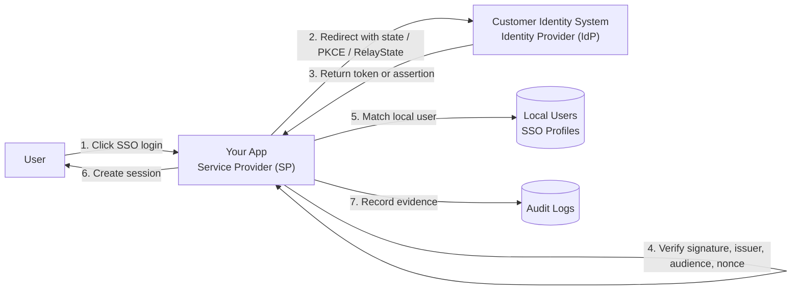
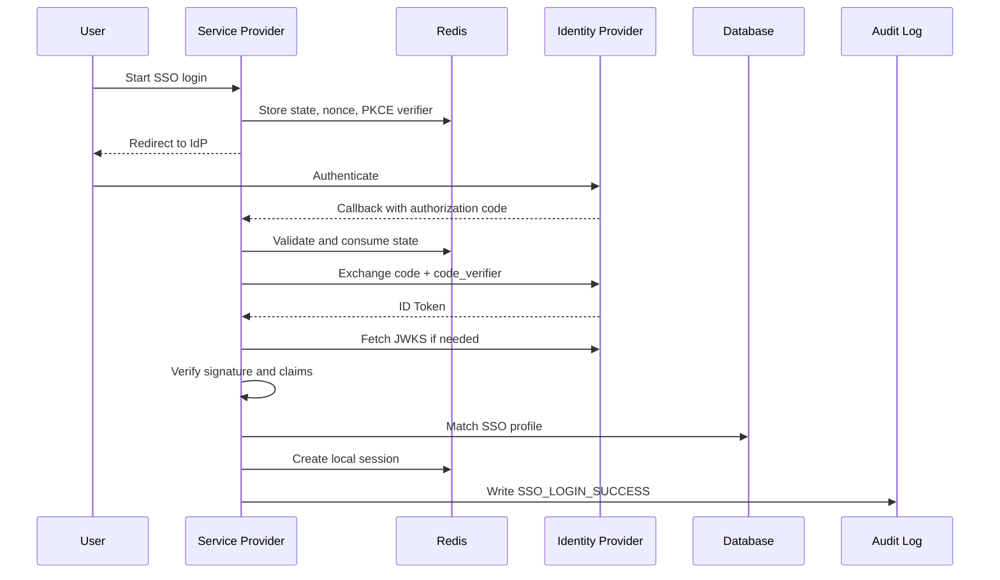
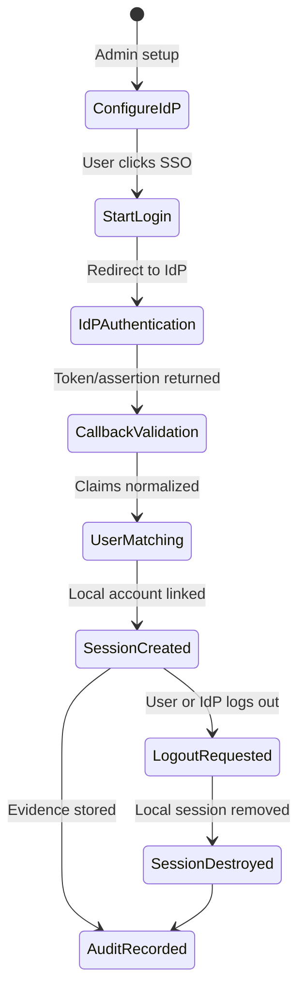

## Introduction: A Map for the Acronym Jungle

After ten posts of enterprise SSO architecture, it is normal for a new programmer to feel overloaded. We talked about OAuth 2.0, OIDC, SAML, PKCE, JWKS, SLO, BCL, X.509, audit logs, tenant isolation, and many other terms that security engineers use every day.

This companion post is a **wiki-style glossary plus tutorial**. It does not replace the ten implementation posts. Instead, it gives you a mental map so that when you see a term like `RelayState` or `SessionIndex`, your brain can immediately place it inside the SSO flow.

The goal is simple: lower the cognitive difficulty. If you are a newbie programmer, read this post first, then revisit the implementation series with less friction.

---

## 1. The One-Minute Mental Model

SSO is not "one login button." It is a trust system.

Your application usually acts as the **Service Provider (SP)**. The customer's identity system acts as the **Identity Provider (IdP)**. The user wants to access your app. Your app asks the IdP, "Who is this person?" The IdP returns a signed proof. Your app verifies that proof, maps the remote identity into a local account, creates a session, and records the event for security auditing.



If you remember only one sentence, remember this:

> SSO is the process of receiving identity proof from a trusted IdP, verifying it cryptographically, mapping it safely to a local user, and managing the session lifecycle.

---

## 2. Big Concept Groups

Before reading the glossary, group the terms like this:

| Concept Group | What It Answers | Examples |
|---|---|---|
| Protocols | How does the SP talk to the IdP? | OAuth 2.0, OIDC, SAML 2.0 |
| Tokens and assertions | What proof does the IdP send back? | ID Token, JWT, SAML Assertion, Logout Token |
| Validation | How do we know the proof is real? | JWKS, X.509, signature, `iss`, `aud`, `nonce`, `exp` |
| Identity mapping | Which local user is this? | `sub`, `NameID`, `email`, `upn`, SSO Profile |
| Session lifecycle | What happens after login and logout? | Redis session, Reverse Session Index, SLO, BCL |
| Key management | How do we keep secrets and certificates safe? | KEK, DEK, Envelope Encryption, Certificate Rotation |
| Multi-tenant safety | How do we isolate customers? | Tenant ID, tenant-scoped providers, cross-tenant validation |
| Compliance | Can we prove what happened? | Audit logs, SOC 2, ISO 27001, GDPR, retention |

---

## 3. Protocol and Architecture Terms

| Term | Beginner Meaning | Why It Matters |
|---|---|---|
| SSO (Single Sign-On) | A user logs in once through an identity system and accesses another app without another password prompt. | It moves authentication trust from your app to an enterprise IdP. |
| Federated Identity | Identity is managed by one system and trusted by another system. | This is the foundation of enterprise login. |
| Identity Provider (IdP) | The system that authenticates the user, such as Microsoft Entra ID, Okta, ADFS, Google Workspace, Ping Identity, or Keycloak. | The IdP issues tokens or assertions. |
| Service Provider (SP) | Your application, which consumes identity proof from the IdP. | The SP must verify everything before creating a local session. |
| Enterprise SSO | SSO designed for companies with strict security, admin configuration, audit, and compliance requirements. | It is much more complex than social login. |
| OAuth 2.0 | An authorization framework for granting access to resources. | It is not pure authentication, but it is often part of login flows. |
| OpenID Connect (OIDC) | An identity layer built on top of OAuth 2.0. | It adds the ID Token so the app can authenticate the user. |
| SAML 2.0 | An XML-based enterprise identity protocol. | Still common in large companies, healthcare, finance, and government. |
| Strategy Pattern | One interface with multiple protocol implementations. | It keeps OIDC, OAuth 2.0, and SAML logic separated and testable. |
| Factory / Registry | Code that selects the correct strategy at runtime. | It avoids huge `if/else` protocol branches. |
| Open/Closed Principle (OCP) | Code should be open to extension but closed to risky modification. | Adding a new protocol should mean adding a new strategy, not rewriting the whole SSO service. |
| Clean Architecture | A structure that separates entities, services, controllers, and infrastructure concerns. | It keeps security logic easier to reason about. |
| SsoFacadeService | The orchestrator that coordinates login, callback, mapping, session creation, and logout. | It gives the rest of the app one clean SSO entry point. |
| ISsoProtocolStrategy | A common interface for OIDC, OAuth 2.0, and SAML strategies. | It makes protocol-specific behavior swappable. |
| IdP Provider Config | The stored configuration for one enterprise IdP. | It contains endpoints, protocol type, secrets, certificates, mappings, and status. |
| Auto-Discovery | Fetching IdP metadata automatically instead of asking admins to type every endpoint. | It reduces manual setup errors. |
| `.well-known/openid-configuration` | The standard OIDC discovery URL. | It reveals OIDC endpoints like authorization, token, UserInfo, JWKS, and logout endpoints. |
| SAML Metadata | XML metadata describing SAML endpoints, entity IDs, and certificates. | It lets the SP know how to trust and contact a SAML IdP. |

---

## 4. Token, Claim, and Assertion Terms

| Term | Beginner Meaning | Why It Matters |
|---|---|---|
| Token | A compact piece of data representing authentication or authorization information. | Tokens are the proof passed between systems. |
| ID Token | An OIDC JWT that says who the user is. | Your app must verify it before trusting the user identity. |
| Access Token | A token used to access an API or resource. | It proves authorization, not necessarily user identity. |
| JWT (JSON Web Token) | A signed JSON token with header, payload, and signature. | OIDC commonly uses JWTs for ID Tokens. |
| Header | The JWT part that says which algorithm and key ID were used. | It helps find the correct verification key. |
| Payload | The JWT part containing claims like `sub`, `iss`, `aud`, `exp`, and `nonce`. | It is untrusted until the signature is verified. |
| Signature | Cryptographic proof that the token was issued by the expected party and not modified. | Signature validation is non-negotiable. |
| Claim | A named fact inside a token or assertion. | Claims become the raw material for user matching and attribute mapping. |
| `sub` | Subject identifier in OIDC. | Often the most stable user identifier from the IdP. |
| `iss` | Issuer claim. | Confirms which IdP issued the token. |
| `aud` | Audience claim. | Confirms the token was meant for your client application. |
| `exp` | Expiration time. | Prevents old tokens from being accepted forever. |
| `iat` | Issued-at time. | Helps detect weird clock or token freshness problems. |
| `nonce` | A random value stored before login and checked in the ID Token. | Prevents replay and token injection attacks. |
| `jti` | JWT ID, a unique token identifier. | Useful for replay protection, especially logout tokens. |
| `kid` | Key ID in the JWT header. | Tells the app which JWKS key should verify the signature. |
| UserInfo Endpoint | An OIDC endpoint that returns user profile claims. | Used as fallback or enrichment after token validation. |
| SAML Assertion | XML identity proof from a SAML IdP. | Similar role to an ID Token, but XML-based. |
| `NameID` | The SAML subject identifier. | Often used to link a SAML user to a local account. |
| `SessionIndex` | A SAML session identifier. | Important for Single Logout and reverse session tracking. |
| `AuthnStatement` | A SAML assertion section describing authentication. | It helps identify session and authentication context. |
| `SAMLResponse` | The SAML response returned to the SP. | It contains the signed assertion that must be validated. |
| `AuthnRequest` | A SAML login request from the SP to the IdP. | Starts a SAML login flow. |
| `LogoutRequest` | A SAML logout request. | Used in SAML Single Logout flows. |
| Logout Token | An OIDC JWT sent during Back-Channel Logout. | It tells the SP to terminate sessions without browser involvement. |

---

## 5. Security Validation Terms

| Term | Beginner Meaning | Why It Matters |
|---|---|---|
| Signature Verification | Checking that a token or assertion was signed by a trusted key. | Without it, attackers can forge identities. |
| JWKS (JSON Web Key Set) | A JSON document containing public keys for verifying JWT signatures. | OIDC validation depends on it. |
| `jwks_uri` | The URL where the IdP publishes JWKS keys. | The SP fetches keys from here. |
| X.509 Certificate | A certificate containing a public key and identity metadata. | SAML commonly uses X.509 certificates for signing trust. |
| Public Key | A key used to verify signatures. | It can be stored openly. |
| Private Key | A secret key used to sign or decrypt. | It must be protected carefully. |
| XML Digital Signature | Signature format used by SAML XML documents. | It proves the XML assertion was not modified. |
| Canonicalization (C14N) | Normalizing XML before signature verification. | XML signatures are fragile without exact canonicalization. |
| XML Signature Wrapping (XSW) | An attack where malicious XML tricks the parser into trusting the wrong signed element. | A classic SAML implementation danger. |
| `RelayState` | SAML state value carried through redirects. | Like OIDC `state`, it prevents CSRF and links request to response. |
| `state` | OIDC/OAuth random value stored before redirect and checked on callback. | Protects callback integrity and CSRF. |
| CSRF | Cross-Site Request Forgery. | An attacker tricks a browser into sending an unintended request. |
| Replay Attack | Reusing an old valid token or message. | Nonces, `jti`, short TTL, and state consumption help stop it. |
| Algorithm Confusion | Accepting an unsafe or unexpected signing algorithm. | Always pin expected algorithms like `RS256`. |
| `alg: "none"` | A dangerous JWT header meaning no signature. | A secure app must reject unsigned tokens. |
| Clock Skew / Clock Tolerance | Small time difference between systems. | Token time checks need reasonable tolerance, not blind trust. |
| Audience Restriction | Ensuring a token/assertion is meant for this SP. | Stops tokens issued for another app from being reused. |
| Issuer Validation | Ensuring the token came from the configured IdP. | Prevents trusting the wrong identity system. |
| ATO (Account Takeover) | An attacker gains access to someone else's account. | Bad user matching can directly cause ATO. |
| PKCE | Proof Key for Code Exchange. | Protects Authorization Code Flow from code interception. |
| `code_verifier` | A random secret generated by the client before redirect. | Used later to prove the callback belongs to the original login attempt. |
| `code_challenge` | A hashed version of the `code_verifier`. | Sent to the IdP before the code exchange. |
| Authorization Code Flow | OAuth/OIDC flow where a short-lived code is exchanged server-side for tokens. | The recommended secure flow for web apps. |
| Implicit Flow | Older flow where tokens return directly through the browser. | Deprecated because tokens can leak more easily. |

---

## 6. Identity Mapping and Account Terms

| Term | Beginner Meaning | Why It Matters |
|---|---|---|
| Attribute Mapping | Translating IdP-specific claims into your app's standard user fields. | Different IdPs use different claim names. |
| Mapping Pipeline | Ordered steps that transform remote attributes into local profile fields. | It makes mapping predictable and testable. |
| Transform Engine | Code that applies transformations like lowercase, trim, regex, or default values. | It cleans messy IdP data. |
| Default Mappings | Pre-filled mapping templates for common IdPs. | They reduce admin setup work. |
| `email` | Common user email claim. | Useful but not always stable enough as the only identifier. |
| `upn` | User Principal Name, common in Microsoft identity systems. | Often looks like an email but may not be identical to email. |
| `preferred_username` | OIDC claim for the user's preferred username. | Useful as a display or login identifier. |
| External User ID | The stable user ID from the IdP. | Better for linking than mutable fields like display name. |
| SSO Profile | Local table/entity linking an external IdP identity to a local user. | Enables one user to have multiple external identities. |
| User Matching | Finding the correct local user for a remote identity. | Must be strict to avoid account takeover. |
| Account Linking | Connecting an IdP identity to an existing local account. | Makes future SSO logins deterministic. |
| ENFORCED Mode | Once SSO is linked, local password login is blocked. | Enterprise customers often require this. |
| Local Password | Password stored and checked by your own app. | Usually disabled for enforced SSO users. |
| 2FA / TOTP | Time-based one-time password factor. | SSO users may bypass local TOTP if the enterprise IdP handles MFA. |
| JIT Provisioning | Just-In-Time account creation during SSO login. | Convenient, but risky if business rules require explicit accounts. |
| SsoUserClaims | Normalized claim object used internally after protocol processing. | Decouples protocol quirks from account matching logic. |

---

## 7. Session and Logout Terms

| Term | Beginner Meaning | Why It Matters |
|---|---|---|
| Session | Local proof that the user is logged in to your app. | SSO validation usually ends by creating a local session. |
| Redis Session | Session data stored in Redis. | Fast and easy to expire or delete. |
| Stateful Session | The server stores session state. | Allows central logout and session termination. |
| SLO (Single Logout) | Logging out from SP and IdP session contexts together. | Prevents "logout here but still logged in there" problems. |
| SP-Initiated Logout | User starts logout from your app. | Your app deletes local session and notifies the IdP. |
| IdP-Initiated Logout | The IdP tells your app to log a user out. | Needed when admins revoke sessions centrally. |
| Front-Channel Logout | Logout message goes through the browser. | Simple but unreliable if the browser is closed. |
| Back-Channel Logout (BCL) | Logout message goes server-to-server. | More reliable and works without the user's browser. |
| Reverse Session Index | Mapping from IdP session ID to local session IDs. | Lets your app find sessions to terminate during BCL or SLO. |
| `sid` | OIDC session identifier. | Used to locate sessions for logout. |
| `SessionIndex` | SAML session identifier. | Used for SAML logout tracking. |
| Multi-Device Session Termination | Ending all sessions for a user across laptop, phone, and tablet. | Required when the IdP revokes a user globally. |
| Webhook | Server-to-server notification. | Can notify frontend or other systems about logout events. |
| WebSocket Notification | Real-time message pushed to the UI. | Helps immediately kick a logged-out user out of the interface. |
| Health Check | Endpoint or job confirming a service is alive. | Useful for BCL endpoints and monitoring. |
| Metrics | Numeric operational signals like latency and success rate. | Helps detect broken logout flows. |

---

## 8. Encryption, Certificate, and Key Terms

| Term | Beginner Meaning | Why It Matters |
|---|---|---|
| Secret | Sensitive value like client secret, private key, or certificate password. | Must never be stored in plaintext. |
| Plaintext | Unencrypted data. | Dangerous for secrets at rest. |
| Ciphertext | Encrypted data. | Safe to store when keys are protected. |
| Envelope Encryption | Encrypt data with a data key, then encrypt that data key with a master key. | Reduces blast radius and supports rotation. |
| KEK (Key Encryption Key) | Key used to encrypt other keys. | Usually stored in KMS or environment-backed secret storage. |
| DEK (Data Encryption Key) | Key used to encrypt actual provider config. | Can be unique per provider or tenant. |
| AES-GCM | Authenticated encryption mode. | Protects confidentiality and integrity. |
| AAD (Additional Authenticated Data) | Extra context bound into encryption verification. | Helps prevent ciphertext being reused in the wrong context. |
| HKDF | Key derivation function. | Can derive scoped keys from master material. |
| Client Secret | OAuth/OIDC application's secret with the IdP. | If leaked, attackers may impersonate your app. |
| SAML Private Key | SP-owned private key used for signing/decryption in SAML setups. | Must be encrypted at rest. |
| mTLS | Mutual TLS, where both client and server authenticate with certificates. | Used in stricter enterprise environments. |
| Certificate Rotation | Replacing old certificates or keys with new ones. | Prevents expiry outages and limits compromised key damage. |
| Key Rollover | Period where old and new keys are both accepted. | Avoids downtime during key changes. |
| JWKS Cache | Cached public keys from the IdP. | Improves performance but must handle rotation. |
| Cache Invalidation | Removing stale cache entries. | Needed after emergency key changes. |
| Emergency Key Revocation | Immediately distrusting a compromised key. | Critical incident response mechanism. |
| Certificate Expiry | Time when a certificate stops being valid. | Expired SAML certificates can break all logins. |
| Fingerprint | Hash-like identifier for a certificate or key. | Helps admins identify exactly which key is active. |

---

## 9. Multi-Tenant and Isolation Terms

| Term | Beginner Meaning | Why It Matters |
|---|---|---|
| Tenant | One customer or organization inside a shared SaaS platform. | Each tenant needs isolated SSO configuration. |
| Multi-Tenant SSO | One platform supporting many customers' IdPs. | Adds isolation and routing complexity. |
| Tenant Resolution | Determining which tenant a request belongs to. | Must happen before selecting IdP config. |
| Tenant-Scoped Provider | IdP provider config tied to one tenant. | Prevents using Customer A's IdP for Customer B. |
| Shared Providers Model | Multiple tenants share provider records. | Simple but risky for strong isolation. |
| Per-Tenant Providers Model | Each tenant has its own provider records. | Better balance for SaaS SSO. |
| Isolated Databases Model | Each tenant has separate data storage. | Strongest isolation, higher operational cost. |
| Cross-Tenant Attack | Attempt to use one tenant's identity data in another tenant's flow. | A major SaaS security risk. |
| Tenant-Aware State | `state` value includes tenant context. | Helps callback validation select the right tenant. |
| Tenant-Aware JWKS Caching | JWKS cache keys include tenant/provider context. | Prevents key confusion between tenants. |
| Tenant Admin Guard | Authorization layer for tenant administrators. | Stops admins from editing other tenants' SSO settings. |
| Tenant Onboarding | Setup process for connecting a new customer's IdP. | Needs discovery, mapping, test login, and certificate checks. |

---

## 10. Audit, Compliance, and Operations Terms

| Term | Beginner Meaning | Why It Matters |
|---|---|---|
| Audit Log | Security-focused record of important actions. | Used for forensics, compliance, and customer trust. |
| Application Log | Developer-focused diagnostic log. | Useful, but not the same as audit evidence. |
| Immutable | Once written, it cannot be changed. | Audit logs should be resistant to tampering. |
| Append-Only | New events are added, old events are not edited. | Preserves evidence order. |
| Tamper-Evident | Modification can be detected. | Hash chains can help prove integrity. |
| Hash Chain | Each event hash includes the previous event hash. | Makes hidden modification difficult. |
| Event Taxonomy | Standard list of event types. | Keeps audit logs searchable and consistent. |
| Alert Rule | Logic that detects suspicious patterns. | Example: too many failed logins from one IP. |
| Brute Force | Many password or login attempts against one target. | Needs rate limiting and alerting. |
| Credential Stuffing | Trying leaked credentials across accounts. | Often visible as distributed login failures. |
| Compliance Report | Structured output showing security events and controls. | Helps customers, auditors, and internal teams. |
| SOC 2 Type II | Audit framework for controls over time. | Enterprise SaaS buyers often ask for it. |
| ISO 27001 | Information security management standard. | Common enterprise compliance requirement. |
| HIPAA | US healthcare privacy and security regulation. | Relevant for healthcare systems. |
| GDPR | EU data protection regulation. | Affects personal data handling and retention. |
| PII | Personally identifiable information. | Audit logs should minimize and protect it. |
| Retention | How long data is kept. | Compliance requires clear retention rules. |
| Archival | Moving older logs to cheaper long-term storage. | Preserves evidence without overloading primary DB. |
| Anonymization | Removing or masking personal data. | Helps privacy compliance. |
| Dashboard | UI for observing audit and security events. | Helps admins investigate and monitor. |

---

## 11. Tutorial: Trace One Login End to End

Let us walk through one OIDC login using the terms above.

1. The user clicks "Login with SSO" for `acme`.
2. The SP resolves tenant `acme` and loads the tenant-scoped IdP provider config.
3. The OIDC strategy generates a random `state`, `nonce`, and PKCE `code_verifier`.
4. The SP stores these values in Redis with a short TTL.
5. The browser redirects to the IdP authorization endpoint with `state`, `nonce`, and `code_challenge`.
6. The IdP authenticates the user and redirects back with an authorization code.
7. The SP validates `state` and exchanges the code with `code_verifier`.
8. The IdP returns an ID Token.
9. The SP checks the JWT header, finds `kid`, fetches the JWKS, and verifies the signature.
10. The SP validates `iss`, `aud`, `exp`, `iat`, and `nonce`.
11. The SP maps claims like `sub`, `email`, `upn`, and `preferred_username` into `SsoUserClaims`.
12. The matching service finds the local `UserSsoProfile`.
13. If ENFORCED mode is enabled, local password login remains blocked for this user.
14. The SP creates a local Redis session.
15. The audit service records `SSO_LOGIN_SUCCESS`.



---

## 12. Tutorial: The Callback Validation Checklist

When you implement callback handling, do not trust the payload first and verify later. Verify first, then map.

```typescript
interface CallbackValidationChecklist {
  stateWasFoundAndConsumed: boolean;
  pkceVerifierMatched: boolean;
  signatureVerified: boolean;
  issuerMatched: boolean;
  audienceMatched: boolean;
  tokenNotExpired: boolean;
  nonceMatched: boolean;
  algorithmPinned: boolean;
  tenantMatched: boolean;
}

function canTrustIdentity(checks: CallbackValidationChecklist): boolean {
  return Object.values(checks).every(Boolean);
}
```

This tiny checklist is not production code, but it is a good beginner mental model. Every `false` value is a reason to reject the login before creating a session.

---

## 13. Tutorial: The Logout Mental Model

Login answers: "Who is this person?"

Logout answers: "Which sessions must die?"

That is why the **Reverse Session Index** matters. During login, store a mapping from the IdP session identifier to local sessions:

```text
sso:sid-map:{providerId}:{idpSessionId} -> [localSessionId1, localSessionId2]
```

Then, when a Back-Channel Logout request arrives:

1. Verify the Logout Token or SAML `LogoutRequest`.
2. Extract `sid`, `sub`, `NameID`, or `SessionIndex`.
3. Look up matching local sessions in the Reverse Session Index.
4. Destroy those Redis sessions.
5. Notify active UIs through WebSocket if needed.
6. Record an audit event like `SESSION_TERMINATED_BCL`.

---

## 14. What to Memorize First

If you are new, memorize these first:

| First-Rank Term | Why |
|---|---|
| IdP / SP | You need to know who issues proof and who consumes proof. |
| OIDC / SAML | These are the main enterprise SSO protocols. |
| ID Token / SAML Assertion | These are the core identity proofs. |
| JWKS / X.509 | These are how signatures become verifiable. |
| `state` / `nonce` / `RelayState` | These protect the login round trip. |
| `sub` / `NameID` | These help identify the remote user. |
| Attribute Mapping | This turns IdP data into local user data. |
| SSO Profile | This links remote identity to local user. |
| SLO / BCL | These explain logout beyond deleting a browser cookie. |
| Audit Log | This is how you prove what happened. |

Once these are stable in your head, the rest of the SSO series becomes much easier to read.

---

## 15. Final Beginner Advice

Do not learn SSO as a bag of acronyms. Learn it as a lifecycle:



Every professional term fits somewhere in this lifecycle. When you feel lost, ask: "Is this term about configuration, proof, validation, mapping, session, key management, tenant isolation, or audit?"

That one question usually puts the concept back into place.

---
---

## 導言：幫你喺縮寫森林入面搵返張地圖

睇完十篇企業級 SSO 架構文之後，新手 Programmer 覺得 overloaded 係好正常嘅。入面有 OAuth 2.0、OIDC、SAML、PKCE、JWKS、SLO、BCL、X.509、audit logs、tenant isolation，仲有好多 Security Engineer 日日講嘅 terms。

呢篇補充文係一份 **wiki-style glossary 加 tutorial**。佢唔係取代之前十篇 implementation posts，而係幫你整一張 mental map。當你見到 `RelayState` 或者 `SessionIndex`，你個腦可以即刻知道佢喺 SSO flow 入面邊個位置。

目標好簡單：降低認知難度。如果你係 newbie programmer，可以先睇呢篇，再返去睇 implementation series，會順好多。

---

## 1. 一分鐘 Mental Model

SSO 唔係「加一粒 login button」咁簡單。佢係一套 trust system。

你個 application 通常係 **Service Provider (SP)**。客戶嘅 identity system 就係 **Identity Provider (IdP)**。User 想入你個 app，你個 app 問 IdP：「呢個人係邊個？」IdP 回傳一份 signed proof。你個 app 驗證份 proof，將 remote identity map 去 local account，建立 session，然後記低 audit event。


如果你只記一句，就記呢句：

> SSO 就係由可信 IdP 接收 identity proof，用 cryptography 驗證佢，安全咁 map 去 local user，然後管理成個 session lifecycle。

---

## 2. 大概念分類

睇 glossary 之前，先將 terms 分成幾組：

| Concept Group | 佢答緊咩問題 | Examples |
|---|---|---|
| Protocols | SP 點樣同 IdP 溝通？ | OAuth 2.0, OIDC, SAML 2.0 |
| Tokens and assertions | IdP 交返咩 proof？ | ID Token, JWT, SAML Assertion, Logout Token |
| Validation | 點知份 proof 係真？ | JWKS, X.509, signature, `iss`, `aud`, `nonce`, `exp` |
| Identity mapping | 呢個 remote user 對應邊個 local user？ | `sub`, `NameID`, `email`, `upn`, SSO Profile |
| Session lifecycle | Login / logout 之後發生咩？ | Redis session, Reverse Session Index, SLO, BCL |
| Key management | Secrets 同 certificates 點樣保護？ | KEK, DEK, Envelope Encryption, Certificate Rotation |
| Multi-tenant safety | 點樣隔離唔同客戶？ | Tenant ID, tenant-scoped providers, cross-tenant validation |
| Compliance | 點樣證明發生過咩事？ | Audit logs, SOC 2, ISO 27001, GDPR, retention |

---

## 3. Protocol 同 Architecture Terms

| Term | 新手解釋 | 點解重要 |
|---|---|---|
| SSO (Single Sign-On) | User 透過一個 identity system login 一次，就可以入另一個 app。 | Authentication trust 由你個 app 轉移去 enterprise IdP。 |
| Federated Identity | 一個 system 管 identity，另一個 system 信佢。 | 呢個係 enterprise login 嘅地基。 |
| Identity Provider (IdP) | 負責 authenticate user 嘅 system，例如 Microsoft Entra ID、Okta、ADFS、Google Workspace、Ping Identity、Keycloak。 | IdP 會 issue tokens 或 assertions。 |
| Service Provider (SP) | 你個 application，負責 consume IdP 交返嚟嘅 identity proof。 | SP 一定要 verify 晒先可以 create local session。 |
| Enterprise SSO | 為公司而設嘅 SSO，有 admin config、audit、compliance、security requirements。 | 複雜過 social login 好多。 |
| OAuth 2.0 | Authorization framework，用嚟授權 access resources。 | 佢唔係純 authentication，但經常係 login flow 一部分。 |
| OpenID Connect (OIDC) | 起喺 OAuth 2.0 上面嘅 identity layer。 | 加咗 ID Token，令 app 可以 authenticate user。 |
| SAML 2.0 | XML-based enterprise identity protocol。 | 大公司、醫療、金融、政府系統仲好常用。 |
| Strategy Pattern | 一個 interface，幾個 protocol implementations。 | 將 OIDC、OAuth 2.0、SAML logic 分開，容易 test。 |
| Factory / Registry | Runtime 揀正確 strategy 嘅 code。 | 避免成個 service 變成巨大 `if/else`。 |
| Open/Closed Principle (OCP) | Code 應該容易 extension，但唔應該成日改舊 logic。 | 加新 protocol 時，最好加新 strategy，而唔係重寫 SSO service。 |
| Clean Architecture | 分開 entities、services、controllers、infrastructure concerns。 | Security logic 會易啲 reason about。 |
| SsoFacadeService | Orchestrator，負責 login、callback、mapping、session、logout。 | 令其他 code 有一個清晰 SSO entry point。 |
| ISsoProtocolStrategy | OIDC、OAuth 2.0、SAML 共用嘅 interface。 | Protocol-specific behavior 可以互換。 |
| IdP Provider Config | 某個 enterprise IdP 嘅 stored configuration。 | 入面有 endpoints、protocol type、secrets、certificates、mappings、status。 |
| Auto-Discovery | 自動 fetch IdP metadata，唔使 admin 人手填晒 endpoint。 | 減少 setup 錯誤。 |
| `.well-known/openid-configuration` | OIDC standard discovery URL。 | 會公開 authorization、token、UserInfo、JWKS、logout endpoints。 |
| SAML Metadata | 描述 SAML endpoints、entity IDs、certificates 嘅 XML metadata。 | SP 靠佢知道點樣 trust 同 contact SAML IdP。 |

---

## 4. Token、Claim、Assertion Terms

| Term | 新手解釋 | 點解重要 |
|---|---|---|
| Token | 一段代表 authentication 或 authorization information 嘅 data。 | Systems 之間用 tokens 傳 proof。 |
| ID Token | OIDC JWT，講明 user 係邊個。 | 你個 app 一定要 verify 佢先信。 |
| Access Token | 用嚟 access API 或 resource 嘅 token。 | 佢證明 authorization，唔一定證明 identity。 |
| JWT (JSON Web Token) | 有 header、payload、signature 嘅 signed JSON token。 | OIDC ID Token 通常係 JWT。 |
| Header | JWT 入面講 algorithm 同 key ID 嘅部分。 | 幫 app 搵邊條 key verify signature。 |
| Payload | JWT 入面有 claims，例如 `sub`, `iss`, `aud`, `exp`, `nonce`。 | Signature verify 前，payload 係唔可信。 |
| Signature | Cryptographic proof，證明 token 由 expected party issue，而且冇被改。 | Signature validation 係必須。 |
| Claim | Token 或 assertion 入面一個 named fact。 | Claims 係 user matching 同 attribute mapping 嘅原材料。 |
| `sub` | OIDC subject identifier。 | 通常係 IdP 最穩定嘅 user identifier。 |
| `iss` | Issuer claim。 | 確認 token 由邊個 IdP issue。 |
| `aud` | Audience claim。 | 確認 token 係俾你個 client application。 |
| `exp` | Expiration time。 | 防止舊 token 永久有效。 |
| `iat` | Issued-at time。 | 幫手 detect clock 或 freshness 問題。 |
| `nonce` | Login 前 generate 嘅 random value，之後喺 ID Token check 返。 | 防 replay 同 token injection。 |
| `jti` | JWT ID，一個 unique token identifier。 | Logout token replay protection 好有用。 |
| `kid` | JWT header 入面嘅 Key ID。 | 話俾 app 知用 JWKS 入面邊條 key verify signature。 |
| UserInfo Endpoint | OIDC endpoint，返 user profile claims。 | Token validation 後可以做 fallback 或 enrichment。 |
| SAML Assertion | SAML IdP 交返嚟嘅 XML identity proof。 | 角色似 ID Token，但係 XML-based。 |
| `NameID` | SAML subject identifier。 | 常用嚟 link SAML user 去 local account。 |
| `SessionIndex` | SAML session identifier。 | Single Logout 同 reverse session tracking 好重要。 |
| `AuthnStatement` | SAML assertion 入面描述 authentication 嘅 section。 | 幫手識別 session 同 authentication context。 |
| `SAMLResponse` | SP 收到嘅 SAML response。 | 入面有要 validate 嘅 signed assertion。 |
| `AuthnRequest` | SP 發去 IdP 嘅 SAML login request。 | 開始 SAML login flow。 |
| `LogoutRequest` | SAML logout request。 | 用喺 SAML Single Logout flows。 |
| Logout Token | Back-Channel Logout 用嘅 OIDC JWT。 | 通知 SP 喺冇 browser 參與下 terminate sessions。 |

---

## 5. Security Validation Terms

| Term | 新手解釋 | 點解重要 |
|---|---|---|
| Signature Verification | Check token 或 assertion 係咪由 trusted key sign。 | 冇呢步，attacker 可以 forge identity。 |
| JWKS (JSON Web Key Set) | 一份 JSON document，入面有 public keys 去 verify JWT signatures。 | OIDC validation 靠佢。 |
| `jwks_uri` | IdP publish JWKS keys 嘅 URL。 | SP 由呢度 fetch keys。 |
| X.509 Certificate | 包住 public key 同 identity metadata 嘅 certificate。 | SAML 好常用 X.509 certificate 做 signing trust。 |
| Public Key | 用嚟 verify signatures 嘅 key。 | 可以公開存放。 |
| Private Key | 用嚟 sign 或 decrypt 嘅 secret key。 | 必須小心保護。 |
| XML Digital Signature | SAML XML documents 用嘅 signature format。 | 證明 XML assertion 冇被改。 |
| Canonicalization (C14N) | Signature verification 前，將 XML normalize。 | XML signature 好脆弱，冇 exact canonicalization 會出事。 |
| XML Signature Wrapping (XSW) | Attacker 用惡意 XML 令 parser 信錯 signed element。 | SAML implementation 經典危險位。 |
| `RelayState` | SAML redirect 來回帶住嘅 state value。 | 似 OIDC `state`，防 CSRF，同 link request/response。 |
| `state` | OIDC/OAuth redirect 前儲低、callback 時 check 返嘅 random value。 | 保護 callback integrity 同 CSRF。 |
| CSRF | Cross-Site Request Forgery。 | Attacker 令 browser send unintended request。 |
| Replay Attack | 重用舊但有效嘅 token 或 message。 | Nonce、`jti`、short TTL、state consumption 可以擋。 |
| Algorithm Confusion | 接受 unsafe 或 unexpected signing algorithm。 | 要 pin expected algorithm，例如 `RS256`。 |
| `alg: "none"` | 危險 JWT header，意思係冇 signature。 | Secure app 必須 reject unsigned tokens。 |
| Clock Skew / Clock Tolerance | Systems 之間少少時間差。 | Token time checks 需要合理 tolerance，但唔可以盲信。 |
| Audience Restriction | 確保 token/assertion 係俾呢個 SP。 | 防止其他 app 嘅 token 被重用。 |
| Issuer Validation | 確保 token 由 configured IdP issue。 | 防止信錯 identity system。 |
| ATO (Account Takeover) | Attacker 入咗其他人 account。 | User matching 做錯可以直接導致 ATO。 |
| PKCE | Proof Key for Code Exchange。 | 保護 Authorization Code Flow，防 code interception。 |
| `code_verifier` | Redirect 前 client generate 嘅 random secret。 | 之後證明 callback 屬於原本 login attempt。 |
| `code_challenge` | `code_verifier` hash 出嚟嘅值。 | Code exchange 前交俾 IdP。 |
| Authorization Code Flow | OAuth/OIDC flow，用 short-lived code 喺 server-side 換 tokens。 | Web apps 建議用嘅 secure flow。 |
| Implicit Flow | 舊 flow，tokens 直接經 browser 回傳。 | 已 deprecated，因為 tokens 易 leak。 |

---

## 6. Identity Mapping 同 Account Terms

| Term | 新手解釋 | 點解重要 |
|---|---|---|
| Attribute Mapping | 將 IdP-specific claims 翻譯成你 app 嘅 standard user fields。 | 唔同 IdP 用唔同 claim names。 |
| Mapping Pipeline | 一連串有次序嘅 steps，將 remote attributes 轉成 local profile fields。 | Mapping 會 predictable 同 testable。 |
| Transform Engine | 做 lowercase、trim、regex、default values 呢啲 transformations 嘅 code。 | 清理混亂 IdP data。 |
| Default Mappings | 常見 IdP 嘅預設 mapping templates。 | 減少 admin setup 工作。 |
| `email` | 常見 user email claim。 | 有用，但唔一定穩定到可以單獨做 identifier。 |
| `upn` | User Principal Name，Microsoft identity systems 常見。 | 睇落似 email，但未必等於 email。 |
| `preferred_username` | OIDC 入面 user preferred username claim。 | 做 display 或 login identifier 有用。 |
| External User ID | IdP 交出嚟嘅 stable user ID。 | 比 display name 呢啲 mutable fields 更適合 linking。 |
| SSO Profile | Local table/entity，link external IdP identity 去 local user。 | 一個 user 可以有多個 external identities。 |
| User Matching | 為 remote identity 搵正確 local user。 | 一定要嚴格，否則會 account takeover。 |
| Account Linking | 將 IdP identity 接駁去 existing local account。 | 之後 SSO login 先 deterministic。 |
| ENFORCED Mode | SSO linked 後，local password login 被 block。 | Enterprise customers 好常要求。 |
| Local Password | 由你 app 自己 store 同 check 嘅 password。 | Enforced SSO users 通常唔俾用。 |
| 2FA / TOTP | Time-based one-time password factor。 | 如果 enterprise IdP 已處理 MFA，SSO users 可能 bypass local TOTP。 |
| JIT Provisioning | SSO login 時即時 create account。 | 方便，但如果 business rules 要 explicit accounts，就有風險。 |
| SsoUserClaims | Protocol processing 後用嘅 normalized claim object。 | 將 protocol quirks 同 account matching logic decouple。 |

---

## 7. Session 同 Logout Terms

| Term | 新手解釋 | 點解重要 |
|---|---|---|
| Session | User 已 login 你 app 嘅 local proof。 | SSO validation 通常最後會 create local session。 |
| Redis Session | 存喺 Redis 嘅 session data。 | 快，而且容易 expire 或 delete。 |
| Stateful Session | Server-side 存 session state。 | 支援 central logout 同 session termination。 |
| SLO (Single Logout) | SP 同 IdP session contexts 一齊 logout。 | 防止「呢邊 logout 咗，但嗰邊仲 login 緊」。 |
| SP-Initiated Logout | User 由你 app 開始 logout。 | 你 app delete local session，再通知 IdP。 |
| IdP-Initiated Logout | IdP 通知你 app logout 某 user。 | Admin central revoke sessions 時需要。 |
| Front-Channel Logout | Logout message 經 browser 傳。 | 簡單，但 browser 關咗就唔可靠。 |
| Back-Channel Logout (BCL) | Logout message server-to-server 傳。 | 更可靠，唔需要 user browser。 |
| Reverse Session Index | IdP session ID 到 local session IDs 嘅 mapping。 | BCL 或 SLO 時幫 app 搵要 terminate 嘅 sessions。 |
| `sid` | OIDC session identifier。 | 用嚟 locate logout sessions。 |
| `SessionIndex` | SAML session identifier。 | 用喺 SAML logout tracking。 |
| Multi-Device Session Termination | 一次過 end user 喺 laptop、phone、tablet 嘅 sessions。 | IdP global revoke user 時需要。 |
| Webhook | Server-to-server notification。 | 可以通知 frontend 或其他 systems logout events。 |
| WebSocket Notification | Real-time push message 去 UI。 | 令 user interface 即時被踢走。 |
| Health Check | 確認 service alive 嘅 endpoint 或 job。 | BCL endpoints 同 monitoring 好有用。 |
| Metrics | Latency、success rate 呢啲 numeric operational signals。 | 幫手 detect broken logout flows。 |

---

## 8. Encryption、Certificate、Key Terms

| Term | 新手解釋 | 點解重要 |
|---|---|---|
| Secret | Client secret、private key、certificate password 呢啲 sensitive value。 | 絕對唔可以 plaintext store。 |
| Plaintext | 未 encrypt 嘅 data。 | Secrets at rest 用 plaintext 好危險。 |
| Ciphertext | Encrypt 咗嘅 data。 | 只要 keys 保護得好，就適合 storage。 |
| Envelope Encryption | 用 data key encrypt data，再用 master key encrypt data key。 | 減少 blast radius，亦支援 rotation。 |
| KEK (Key Encryption Key) | 用嚟 encrypt 其他 keys 嘅 key。 | 通常放 KMS 或 environment-backed secret storage。 |
| DEK (Data Encryption Key) | 用嚟 encrypt actual provider config 嘅 key。 | 可以 per provider 或 per tenant。 |
| AES-GCM | Authenticated encryption mode。 | 同時保 confidentiality 同 integrity。 |
| AAD (Additional Authenticated Data) | Encryption verification 綁住嘅 extra context。 | 防止 ciphertext 被錯 context 重用。 |
| HKDF | Key derivation function。 | 可以由 master material derive scoped keys。 |
| Client Secret | OAuth/OIDC app 喺 IdP 嘅 secret。 | Leak 咗 attacker 可能 impersonate 你個 app。 |
| SAML Private Key | SP-owned private key，用喺 SAML signing/decryption。 | 必須 encrypted at rest。 |
| mTLS | Mutual TLS，client 同 server 都用 certificate authenticate。 | 嚴格 enterprise environment 會用。 |
| Certificate Rotation | 用新 certificates 或 keys 換走舊嘅。 | 防 expiry outage，同限制 compromised key damage。 |
| Key Rollover | 新舊 keys 同時 accepted 嘅過渡期。 | 避免 key change 造成 downtime。 |
| JWKS Cache | Cache IdP public keys。 | 提升 performance，但要處理 rotation。 |
| Cache Invalidation | 清走 stale cache entries。 | Emergency key changes 後必須做。 |
| Emergency Key Revocation | 立即唔再信 compromised key。 | Critical incident response mechanism。 |
| Certificate Expiry | Certificate 停止 valid 嘅時間。 | Expired SAML certificates 可以令所有 login fail。 |
| Fingerprint | Certificate 或 key 嘅 hash-like identifier。 | Admin 可以精準認出 active key。 |

---

## 9. Multi-Tenant 同 Isolation Terms

| Term | 新手解釋 | 點解重要 |
|---|---|---|
| Tenant | Shared SaaS platform 入面一個 customer 或 organization。 | 每個 tenant 都要 isolated SSO config。 |
| Multi-Tenant SSO | 一個 platform 支援好多 customers 嘅 IdPs。 | 會增加 isolation 同 routing complexity。 |
| Tenant Resolution | 判斷 request 屬於邊個 tenant。 | 揀 IdP config 前一定要做。 |
| Tenant-Scoped Provider | 綁定去一個 tenant 嘅 IdP provider config。 | 防止 Customer A 嘅 IdP 被 Customer B 用咗。 |
| Shared Providers Model | 多個 tenants share provider records。 | 簡單，但 strong isolation 風險較高。 |
| Per-Tenant Providers Model | 每個 tenant 有自己 provider records。 | SaaS SSO 比較平衡嘅做法。 |
| Isolated Databases Model | 每個 tenant 有獨立 data storage。 | Isolation 最強，但 operational cost 高。 |
| Cross-Tenant Attack | 嘗試喺另一個 tenant flow 用某個 tenant 嘅 identity data。 | SaaS 重大 security risk。 |
| Tenant-Aware State | `state` 入面有 tenant context。 | Callback validation 時幫手揀返正確 tenant。 |
| Tenant-Aware JWKS Caching | JWKS cache keys 包 tenant/provider context。 | 防止 tenants 之間 key confusion。 |
| Tenant Admin Guard | Tenant admin authorization layer。 | 防止 admin 改到其他 tenants 嘅 SSO settings。 |
| Tenant Onboarding | 接駁新 customer IdP 嘅 setup process。 | 需要 discovery、mapping、test login、certificate checks。 |

---

## 10. Audit、Compliance、Operations Terms

| Term | 新手解釋 | 點解重要 |
|---|---|---|
| Audit Log | Security-focused record，記低重要 actions。 | 用喺 forensics、compliance、customer trust。 |
| Application Log | Developer-focused diagnostic log。 | 有用，但唔等於 audit evidence。 |
| Immutable | 寫咗之後唔可以改。 | Audit logs 要 resistant to tampering。 |
| Append-Only | 只加新 events，唔 edit 舊 events。 | 保留 evidence order。 |
| Tamper-Evident | 如果被改，可以 detect 到。 | Hash chain 可以幫手 prove integrity。 |
| Hash Chain | 每個 event hash 包埋 previous event hash。 | 令 hidden modification 更難。 |
| Event Taxonomy | Standard event type list。 | 令 audit logs searchable 同 consistent。 |
| Alert Rule | Detect suspicious patterns 嘅 logic。 | 例如同一 IP 太多 failed logins。 |
| Brute Force | 對同一 target 做大量 password 或 login attempts。 | 需要 rate limiting 同 alerting。 |
| Credential Stuffing | 用 leaked credentials 去試好多 accounts。 | 通常會見到 distributed login failures。 |
| Compliance Report | 顯示 security events 同 controls 嘅 structured output。 | 幫 customers、auditors、internal teams。 |
| SOC 2 Type II | 評估 controls 一段時間內運作嘅 audit framework。 | Enterprise SaaS buyers 好常問。 |
| ISO 27001 | Information security management standard。 | 常見 enterprise compliance requirement。 |
| HIPAA | 美國 healthcare privacy/security regulation。 | Healthcare systems 相關。 |
| GDPR | EU data protection regulation。 | 影響 personal data handling 同 retention。 |
| PII | Personally identifiable information。 | Audit logs 應該 minimize 同 protect PII。 |
| Retention | Data 保留幾耐。 | Compliance 需要清楚 retention rules。 |
| Archival | 將舊 logs 搬去 cheaper long-term storage。 | 保留 evidence，同時唔拖慢 primary DB。 |
| Anonymization | 移除或 mask personal data。 | 幫 privacy compliance。 |
| Dashboard | 用嚟 observe audit/security events 嘅 UI。 | Admin investigation 同 monitoring 會用。 |

---

## 11. Tutorial：由頭到尾 Trace 一次 Login

我哋用一個 OIDC login 行一次：

1. User click `acme` 嘅 "Login with SSO"。
2. SP resolve tenant `acme`，load tenant-scoped IdP provider config。
3. OIDC strategy generate random `state`、`nonce`、PKCE `code_verifier`。
4. SP 將呢啲 values 用 short TTL 存入 Redis。
5. Browser redirect 去 IdP authorization endpoint，帶住 `state`、`nonce`、`code_challenge`。
6. IdP authenticate user，然後 redirect 返嚟，帶 authorization code。
7. SP validate `state`，再用 `code_verifier` exchange code。
8. IdP return ID Token。
9. SP check JWT header，搵 `kid`，fetch JWKS，verify signature。
10. SP validate `iss`、`aud`、`exp`、`iat`、`nonce`。
11. SP 將 `sub`、`email`、`upn`、`preferred_username` map 成 `SsoUserClaims`。
12. Matching service 搵 local `UserSsoProfile`。
13. 如果 ENFORCED mode enabled，呢個 user 繼續唔可以用 local password login。
14. SP create local Redis session。
15. Audit service 記低 `SSO_LOGIN_SUCCESS`。


---

## 12. Tutorial：Callback Validation Checklist

做 callback handling 時，唔好先信 payload 再 verify。正確 mental model 係：先 verify，再 map。

```typescript
interface CallbackValidationChecklist {
  stateWasFoundAndConsumed: boolean;
  pkceVerifierMatched: boolean;
  signatureVerified: boolean;
  issuerMatched: boolean;
  audienceMatched: boolean;
  tokenNotExpired: boolean;
  nonceMatched: boolean;
  algorithmPinned: boolean;
  tenantMatched: boolean;
}

function canTrustIdentity(checks: CallbackValidationChecklist): boolean {
  return Object.values(checks).every(Boolean);
}
```

呢段唔係 production code，但係好適合新手建立 mental model。任何一個 `false`，都應該 reject login，唔好 create session。

---

## 13. Tutorial：Logout Mental Model

Login 問：「呢個人係邊個？」

Logout 問：「邊啲 sessions 要死？」

所以 **Reverse Session Index** 好重要。Login 時，儲低 IdP session identifier 到 local sessions 嘅 mapping：

```text
sso:sid-map:{providerId}:{idpSessionId} -> [localSessionId1, localSessionId2]
```

Back-Channel Logout request 到嘅時候：

1. Verify Logout Token 或 SAML `LogoutRequest`。
2. Extract `sid`、`sub`、`NameID` 或 `SessionIndex`。
3. 喺 Reverse Session Index 搵 matching local sessions。
4. Destroy 相關 Redis sessions。
5. 有需要就用 WebSocket 通知 active UIs。
6. 記低 audit event，例如 `SESSION_TERMINATED_BCL`。

---

## 14. 新手應該先背熟咩

如果你係新手，先背熟呢啲：

| First-Rank Term | 點解 |
|---|---|
| IdP / SP | 要知道邊個 issue proof，邊個 consume proof。 |
| OIDC / SAML | 呢兩個係主要 enterprise SSO protocols。 |
| ID Token / SAML Assertion | 呢啲係核心 identity proof。 |
| JWKS / X.509 | Signature 點樣被 verify，靠佢哋。 |
| `state` / `nonce` / `RelayState` | 保護 login round trip。 |
| `sub` / `NameID` | 幫手 identify remote user。 |
| Attribute Mapping | 將 IdP data 轉成 local user data。 |
| SSO Profile | Link remote identity 去 local user。 |
| SLO / BCL | 解釋 logout 點解唔只係 delete browser cookie。 |
| Audit Log | 證明發生過咩事。 |

呢啲概念穩咗之後，成個 SSO series 會易讀好多。

---

## 15. 最後嘅新手建議

唔好將 SSO 當成一袋 acronyms 咁學。將佢當成 lifecycle 咁學：


每一個 professional term 都一定可以放返入呢個 lifecycle 入面。當你迷路，就問自己：「呢個 term 係講 configuration、proof、validation、mapping、session、key management、tenant isolation，定 audit？」

通常一問呢條問題，個 concept 就會返返去正確位置。
