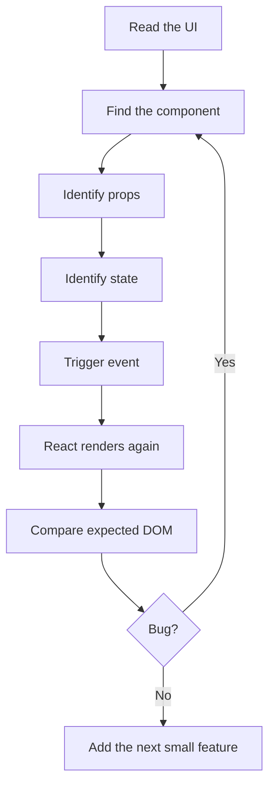

> Series navigation: **Part 2 of 10**  
> Previous: Part 1 taught the shape of a component and JSX.  
> Next: Part 3 uses that interactivity to build forms, lists, and conditional screens.  
> Version note: npm reported `react@19.2.6` while the official docs currently document React 19.2.


## English Version

### Where This Part Fits

Part 1 taught the shape of a component and JSX. In this part we focus on **props, useState, events, derived values, render cycle**. The goal is not to memorize API names. The goal is to build a mental model that helps you read code written by another developer and predict what React will do next.

Props are like a lunch order written by the customer: the child component can read it but should not scribble on the original ticket. State is the component's own notebook: it can update it, and React will ask the component to describe the UI again.

React rewards small, explicit steps. A beginner often tries to understand the whole app at once, then gets lost. A real programmer usually moves in the opposite direction: find one component, find its inputs, find its local memory, find the event that changes that memory, then follow the render.

### Core Terms

| Term | Beginner meaning |
| --- | --- |
| `Props are read-only` | Children receive values from parents. To change parent data, pass an event handler down. |
| `State remembers` | useState stores data between renders and schedules a new render when updated. |
| `Events are camelCase` | React uses onClick, onChange, onSubmit and passes a synthetic event object. |
| `Derived data` | If you can calculate it from props or state, do not duplicate it in another state variable. |

### The Render Story

A React screen is a tree. The root renders `App`, `App` renders smaller components, and those components render even smaller pieces. When state changes, React does not ask you to manually patch the DOM. It calls your component again, receives the next UI description, compares it with the previous description, and updates the browser efficiently.

The beginner mistake is thinking "render" means "delete the whole page and rebuild everything." That is not the useful mental model. A better model is: render means your component function is asked to describe what the UI should look like for the current inputs. React then decides the minimal DOM work.

For this post, keep these names in your head: Props are read-only, State remembers, Events are camelCase, Derived data. Every code example below is just another way of combining those same ideas.

## 粵語中文版

### 今篇喺系列入面嘅位置

Part 1 taught the shape of a component and JSX. 今篇集中講 **props, useState, events, derived values, render cycle**。目標唔係背 API 名，而係建立一個腦內地圖：當你睇到其他人寫嘅 React code，你可以估到下一步 React 會做咩。

Props 好似客人張落單紙：子 component 可以睇，但唔應該改原本張紙。State 就似 component 自己本記事簿：佢可以改，改完 React 會叫佢重新描述一次畫面。

React 最鍾意細步、清楚、可預測。新手成日一嚟就想理解成個 app，結果就迷路。實戰 programmer 通常倒轉做：先搵一個 component，睇佢收咩 input，睇佢自己記住咩 state，睇邊個 event 會改 state，最後跟住 render 條路行。

### 核心 Terms

| Term | 新手理解 |
| --- | --- |
| `Props are read-only` | Children receive values from parents. To change parent data, pass an event handler down. 呢個 term 我哋先保留英文，因為你之後睇官方 docs、Stack Overflow、GitHub issue 都會見到同一個字。 |
| `State remembers` | useState stores data between renders and schedules a new render when updated. 呢個 term 我哋先保留英文，因為你之後睇官方 docs、Stack Overflow、GitHub issue 都會見到同一個字。 |
| `Events are camelCase` | React uses onClick, onChange, onSubmit and passes a synthetic event object. 呢個 term 我哋先保留英文，因為你之後睇官方 docs、Stack Overflow、GitHub issue 都會見到同一個字。 |
| `Derived data` | If you can calculate it from props or state, do not duplicate it in another state variable. 呢個 term 我哋先保留英文，因為你之後睇官方 docs、Stack Overflow、GitHub issue 都會見到同一個字。 |

### Render 呢件事點諗

React 畫面係一棵 tree。root render `App`，`App` render 細 component，細 component 再 render 更細嘅 UI。當 state 改變，React 唔係要你人手 patch DOM；佢會再 call 你個 component，攞到下一個 UI 描述，再同上一個描述比較，最後更新 browser 入面需要改嘅地方。

新手常見誤會係覺得 render 等於「成頁刪晒再砌過」。咁諗會令你驚。更實用嘅諗法係：render 即係 component function 根據而家嘅 inputs 描述畫面；至於 DOM 點樣最少量更新，交俾 React。


### Example 1: Read the Code Slowly

Before reading the snippet, predict three things: what data enters the component, what event can happen, and what visible output should change. After reading it, explain it once in English and once in Cantonese. This habit trains you to understand React code without depending on tutorials forever.


```tsx
import { useState } from 'react';

type CounterProps = {
  label: string;
  initialValue?: number;
};

function Counter({ label, initialValue = 0 }: CounterProps) {
  const [count, setCount] = useState(initialValue);
  const isMilestone = count > 0 && count % 5 === 0;

  return (
    <section className="counter">
      <h2>{label}</h2>
      <output>{count}</output>
      {isMilestone && <p>Milestone reached.</p>}
      <button onClick={() => setCount(count + 1)}>Add one</button>
      <button onClick={() => setCount(c => c - 1)}>Minus one safely</button>
    </section>
  );
}
```


**English walkthrough:** Start from the component boundary. Check the props or local variables first. Then scan for Hooks because Hooks tell you what the component remembers or synchronizes. Finally, read the returned JSX as a plain UI description. If the example has an event handler, imagine the click or typing action, then follow the state update into the next render.

**粵語 walkthrough：** 由 component 邊界開始睇。先睇 props 或 local variables，再掃 Hooks，因為 Hooks 會話你知 component 記住咩或者同步咩。最後將 JSX 當成普通 UI 描述咁讀。如果有 event handler，就想像自己 click 或打字，跟住 state update 行去下一次 render。


### Example 2: Read the Code Slowly

Before reading the snippet, predict three things: what data enters the component, what event can happen, and what visible output should change. After reading it, explain it once in English and once in Cantonese. This habit trains you to understand React code without depending on tutorials forever.


```tsx
type Product = {
  id: string;
  name: string;
  price: number;
};

function ProductRow({
  product,
  onAdd
}: {
  product: Product;
  onAdd: (product: Product) => void;
}) {
  return (
    <li>
      <span>{product.name}</span>
      <strong>${product.price}</strong>
      <button onClick={() => onAdd(product)}>Add</button>
    </li>
  );
}
```


**English walkthrough:** Start from the component boundary. Check the props or local variables first. Then scan for Hooks because Hooks tell you what the component remembers or synchronizes. Finally, read the returned JSX as a plain UI description. If the example has an event handler, imagine the click or typing action, then follow the state update into the next render.

**粵語 walkthrough：** 由 component 邊界開始睇。先睇 props 或 local variables，再掃 Hooks，因為 Hooks 會話你知 component 記住咩或者同步咩。最後將 JSX 當成普通 UI 描述咁讀。如果有 event handler，就想像自己 click 或打字，跟住 state update 行去下一次 render。


### Example 3: Read the Code Slowly

Before reading the snippet, predict three things: what data enters the component, what event can happen, and what visible output should change. After reading it, explain it once in English and once in Cantonese. This habit trains you to understand React code without depending on tutorials forever.


```tsx
function CartDemo() {
  const products = [
    { id: 'tea', name: 'Milk tea', price: 22 },
    { id: 'bun', name: 'Pineapple bun', price: 12 }
  ];
  const [cart, setCart] = useState<Product[]>([]);
  const total = cart.reduce((sum, item) => sum + item.price, 0);

  return (
    <>
      <ul>
        {products.map(product => (
          <ProductRow
            key={product.id}
            product={product}
            onAdd={p => setCart(items => [...items, p])}
          />
        ))}
      </ul>
      <p>Items: {cart.length}</p>
      <p>Total: ${total}</p>
    </>
  );
}
```


**English walkthrough:** Start from the component boundary. Check the props or local variables first. Then scan for Hooks because Hooks tell you what the component remembers or synchronizes. Finally, read the returned JSX as a plain UI description. If the example has an event handler, imagine the click or typing action, then follow the state update into the next render.

**粵語 walkthrough：** 由 component 邊界開始睇。先睇 props 或 local variables，再掃 Hooks，因為 Hooks 會話你知 component 記住咩或者同步咩。最後將 JSX 當成普通 UI 描述咁讀。如果有 event handler，就想像自己 click 或打字，跟住 state update 行去下一次 render。


### Example 4: Read the Code Slowly

Before reading the snippet, predict three things: what data enters the component, what event can happen, and what visible output should change. After reading it, explain it once in English and once in Cantonese. This habit trains you to understand React code without depending on tutorials forever.


```tsx
// Avoid mutating arrays in state.
setCart(items => [...items, product]);      // good: new array
setCart(items => items.filter(i => i.id !== id)); // good: new array

// Avoid this because React may not see a meaningful state change.
cart.push(product);
setCart(cart);
```


**English walkthrough:** Start from the component boundary. Check the props or local variables first. Then scan for Hooks because Hooks tell you what the component remembers or synchronizes. Finally, read the returned JSX as a plain UI description. If the example has an event handler, imagine the click or typing action, then follow the state update into the next render.

**粵語 walkthrough：** 由 component 邊界開始睇。先睇 props 或 local variables，再掃 Hooks，因為 Hooks 會話你知 component 記住咩或者同步咩。最後將 JSX 當成普通 UI 描述咁讀。如果有 event handler，就想像自己 click 或打字，跟住 state update 行去下一次 render。


## Practice Lab: Build It, Break It, Fix It

This lab connects this article to the rest of the series. Do not only paste the code. Type it, rename variables, remove one line at a time, and watch the browser complain. React becomes much less scary when you learn what each error message is trying to protect.

1. Create a fresh Vite React TypeScript project.
2. Copy the smallest example from this post first.
3. Add one feature from the previous post so the knowledge chain stays connected.
4. Add one tiny feature that prepares you for the next post: Part 3 uses that interactivity to build forms, lists, and conditional screens.
5. Open React DevTools and inspect the component tree.
6. Write down which values are props, which values are state, and which values are plain derived variables.

### Cantonese Practice Notes

今篇唔好只係 copy code。你要試吓打錯 prop 名、刪走 dependency、用錯 key、或者將 state 直接 mutate，睇吓 React 同 browser 會點樣提醒你。新手最容易驚 error，但其實 error 係老師傅喺你後面提你：「呢度遲早會爆，依家快啲修正。」

- 如果畫面冇更新，先問：我係咪改咗舊 object，而唔係建立新 object？
- 如果 effect 不停跑，先問：dependency 係咪每次 render 都變成新 reference？
- 如果 list 行為怪，先問：key 係咪穩定 ID，而唔係 array index？
- 如果 form 打唔到字，先問：input `value` 有冇配返 `onChange`？
- 如果 component 好難測，先問：我係咪將太多責任塞咗入同一個 function？



### Debugging Checklist for Part 2

- Read the browser console before changing code randomly.
- Check whether the bug happens before render, during render, or after render in an Effect.
- Use descriptive component names; `ProductCard` teaches your future self more than `Box`.
- Keep event handlers small. If an event needs ten steps, move the calculation into a helper function and test it separately.
- Prefer boring state names: `isOpen`, `selectedId`, `draftTitle`, `status`, `error`.
- When you feel tempted to add a library, first build the tiny version yourself so you know what problem the library solves.


## Common Beginner Mistakes

- Trying to learn React by memorizing syntax only. Syntax matters, but the mental model matters more.
- Mixing data calculation with DOM manipulation. In React, calculate data first, then describe UI.
- Keeping duplicate state. If a value can be calculated from existing props or state, calculate it during render.
- Making one giant component. When a JSX block becomes hard to scan, extract a named component.
- Ignoring official docs. For React 19.2, the official docs are practical and example-heavy.

## 新手常犯錯

- 只背 syntax。Syntax 要識，但 mental model 更重要。
- 將 data calculation 同 DOM manipulation 撈埋一齊。React 入面通常係先計 data，再描述 UI。
- 儲 duplicate state。如果一個 value 可以由現有 props 或 state 計出嚟，就唔好再開多個 state。
- 一個 component 寫到成座山咁大。JSX 一難 scan，就抽做有名 component。
- 唔睇官方 docs。React 19.2 docs 已經有好多實用例子，尤其係 Hooks、Effects、Server APIs 同 Compiler 部分。


## References

- React docs version page: <https://react.dev/versions>
- React 19.2 release notes: <https://react.dev/blog/2025/10/01/react-19-2>
- React Hooks reference: <https://react.dev/reference/react/hooks>
- React Activity reference: <https://react.dev/reference/react/Activity>
- React useEffectEvent reference: <https://react.dev/reference/react/useEffectEvent>
- React Compiler guide: <https://react.dev/learn/react-compiler>
