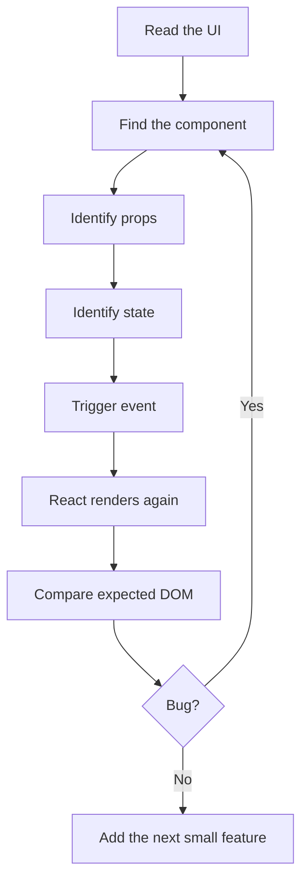

> Series navigation: **Part 6 of 10**  
> Previous: Part 5 synchronized React with outside systems.  
> Next: Part 7 handles performance, memoization, React Compiler, and responsive rendering.  
> Version note: npm reported `react@19.2.6` while the official docs currently document React 19.2.

## Introduction: Where This Part Fits

Part 5 synchronized React with outside systems. In this part we focus on **children, composition, context, custom hooks, provider patterns**. The goal is not to memorize API names. The goal is to build a mental model that helps you read code written by another developer and predict what React will do next.

Composition is like building a lunch set from small dishes. Context is the restaurant's house rule board: every table can read it without the manager whispering the same rule to each waiter.

React rewards small, explicit steps. A beginner often tries to understand the whole app at once, then gets lost. A real programmer usually moves in the opposite direction: find one component, find its inputs, find its local memory, find the event that changes that memory, then follow the render.

## Core Terms

| Term | Beginner meaning |
| --- | --- |
| `children` | A component can accept JSX inside its opening and closing tags. |
| `composition` | Prefer passing components and elements instead of creating rigid inheritance structures. |
| `Context` | Share values across a subtree without prop drilling. |
| `custom Hook` | Extract reusable stateful logic into a function whose name starts with use. |

## The Render Story

A React screen is a tree. The root renders `App`, `App` renders smaller components, and those components render even smaller pieces. When state changes, React does not ask you to manually patch the DOM. It calls your component again, receives the next UI description, compares it with the previous description, and updates the browser efficiently.

The beginner mistake is thinking "render" means "delete the whole page and rebuild everything." That is not the useful mental model. A better model is: render means your component function is asked to describe what the UI should look like for the current inputs. React then decides the minimal DOM work.

For this post, keep these names in your head: children, composition, Context, custom Hook. Every code example below is just another way of combining those same ideas.

## Code Implementation: Examples and Walkthroughs

### Example 1: Read the Code Slowly

Before reading the snippet, predict three things: what data enters the component, what event can happen, and what visible output should change. After reading it, explain it back in your own words. This habit trains you to understand React code without depending on tutorials forever.


```tsx
function Panel({
  title,
  children
}: {
  title: string;
  children: React.ReactNode;
}) {
  return (
    <section className="panel">
      <h2>{title}</h2>
      <div>{children}</div>
    </section>
  );
}

function SettingsPage() {
  return (
    <Panel title="Profile settings">
      <AvatarPicker />
      <DisplayNameInput />
    </Panel>
  );
}
```


**English walkthrough:** Start from the component boundary. Check the props or local variables first. Then scan for Hooks because Hooks tell you what the component remembers or synchronizes. Finally, read the returned JSX as a plain UI description. If the example has an event handler, imagine the click or typing action, then follow the state update into the next render.

### Example 2: Read the Code Slowly

Before reading the snippet, predict three things: what data enters the component, what event can happen, and what visible output should change. After reading it, explain it back in your own words. This habit trains you to understand React code without depending on tutorials forever.


```tsx
import { createContext, useContext, useMemo, useState } from 'react';

type Theme = 'light' | 'dark';
type ThemeContextValue = {
  theme: Theme;
  setTheme: (theme: Theme) => void;
};

const ThemeContext = createContext<ThemeContextValue | null>(null);

export function ThemeProvider({ children }: { children: React.ReactNode }) {
  const [theme, setTheme] = useState<Theme>('light');
  const value = useMemo(() => ({ theme, setTheme }), [theme]);

  return <ThemeContext value={value}>{children}</ThemeContext>;
}

export function useTheme() {
  const value = useContext(ThemeContext);
  if (!value) throw new Error('useTheme must be used inside ThemeProvider');
  return value;
}
```


**English walkthrough:** Start from the component boundary. Check the props or local variables first. Then scan for Hooks because Hooks tell you what the component remembers or synchronizes. Finally, read the returned JSX as a plain UI description. If the example has an event handler, imagine the click or typing action, then follow the state update into the next render.

### Example 3: Read the Code Slowly

Before reading the snippet, predict three things: what data enters the component, what event can happen, and what visible output should change. After reading it, explain it back in your own words. This habit trains you to understand React code without depending on tutorials forever.


```tsx
function ThemeToggle() {
  const { theme, setTheme } = useTheme();

  return (
    <button onClick={() => setTheme(theme === 'light' ? 'dark' : 'light')}>
      Switch to {theme === 'light' ? 'dark' : 'light'}
    </button>
  );
}
```


**English walkthrough:** Start from the component boundary. Check the props or local variables first. Then scan for Hooks because Hooks tell you what the component remembers or synchronizes. Finally, read the returned JSX as a plain UI description. If the example has an event handler, imagine the click or typing action, then follow the state update into the next render.

### Example 4: Read the Code Slowly

Before reading the snippet, predict three things: what data enters the component, what event can happen, and what visible output should change. After reading it, explain it back in your own words. This habit trains you to understand React code without depending on tutorials forever.


```tsx
function useLocalStorageState<T>(key: string, initialValue: T) {
  const [value, setValue] = useState<T>(() => {
    const raw = localStorage.getItem(key);
    return raw ? JSON.parse(raw) : initialValue;
  });

  useEffect(() => {
    localStorage.setItem(key, JSON.stringify(value));
  }, [key, value]);

  return [value, setValue] as const;
}

function DraftEditor() {
  const [draft, setDraft] = useLocalStorageState('draft', '');
  return <textarea value={draft} onChange={e => setDraft(e.target.value)} />;
}
```


**English walkthrough:** Start from the component boundary. Check the props or local variables first. Then scan for Hooks because Hooks tell you what the component remembers or synchronizes. Finally, read the returned JSX as a plain UI description. If the example has an event handler, imagine the click or typing action, then follow the state update into the next render.

## Practice Lab: Build It, Break It, Fix It

This lab connects this article to the rest of the series. Do not only paste the code. Type it, rename variables, remove one line at a time, and watch the browser complain. React becomes much less scary when you learn what each error message is trying to protect.

1. Create a fresh Vite React TypeScript project.
2. Copy the smallest example from this post first.
3. Add one feature from the previous post so the knowledge chain stays connected.
4. Add one tiny feature that prepares you for the next post: Part 7 handles performance, memoization, React Compiler, and responsive rendering.
5. Open React DevTools and inspect the component tree.
6. Write down which values are props, which values are state, and which values are plain derived variables.



### Debugging Checklist for Part 6

- Read the browser console before changing code randomly.
- Check whether the bug happens before render, during render, or after render in an Effect.
- Use descriptive component names; `ProductCard` teaches your future self more than `Box`.
- Keep event handlers small. If an event needs ten steps, move the calculation into a helper function and test it separately.
- Prefer boring state names: `isOpen`, `selectedId`, `draftTitle`, `status`, `error`.
- When you feel tempted to add a library, first build the tiny version yourself so you know what problem the library solves.

## Common Beginner Mistakes

- Trying to learn React by memorizing syntax only. Syntax matters, but the mental model matters more.
- Mixing data calculation with DOM manipulation. In React, calculate data first, then describe UI.
- Keeping duplicate state. If a value can be calculated from existing props or state, calculate it during render.
- Making one giant component. When a JSX block becomes hard to scan, extract a named component.
- Ignoring official docs. For React 19.2, the official docs are practical and example-heavy.

## Looking Ahead

This part is one step in the series. Keep the code small, verify it in the browser, and continue with the next topic: Part 7 handles performance, memoization, React Compiler, and responsive rendering. The important habit is steady practice: read the component boundary, identify props and state, trigger one event, and confirm the next render.


---
---

## 簡介：今篇喺系列入面嘅位置

上一篇我哋學咗點樣將 React 同外部系統同步。今篇集中講 **children, composition, context, custom hooks, provider patterns**。目標唔係背 API 名，而係建立一個腦內地圖：當你睇到其他人寫嘅 React code，你可以估到下一步 React 會做咩。

Composition 好似砌套餐：每碟細餸可以自由組合。Context 就似餐廳牆上規則板：每張枱都睇到，唔使經理逐個侍應傳話。

React 最鍾意細步、清楚、可預測。新手成日一嚟就想理解成個 app，結果就迷路。實戰 programmer 通常倒轉做：先搵一個 component，睇佢收咩 input，睇佢自己記住咩 state，睇邊個 event 會改 state，最後跟住 render 條路行。

## 核心 Terms

| Term | 新手理解 |
| --- | --- |
| `children` | `children` 係 component opening/closing tags 中間夾住嘅 JSX。 |
| `composition` | 用細 component 拼大 UI，通常比 inheritance 更適合 React。 |
| `Context` | Context 可以喺一棵 subtree 入面共享 value，避免 props 一層層傳落去。 |
| `custom Hook` | 以 `use` 開頭嘅 function，用嚟抽走可重用 stateful logic。 |

## Render 呢件事點諗

React 畫面係一棵 tree。root render `App`，`App` render 細 component，細 component 再 render 更細嘅 UI。當 state 改變，React 唔係要你人手 patch DOM；佢會再 call 你個 component，攞到下一個 UI 描述，再同上一個描述比較，最後更新 browser 入面需要改嘅地方。

新手常見誤會係覺得 render 等於「成頁刪晒再砌過」。咁諗會令你驚。更實用嘅諗法係：render 即係 component function 根據而家嘅 inputs 描述畫面；至於 DOM 點樣最少量更新，交俾 React。

## Code 實作：Examples 同 Walkthrough

### 例子 1：慢慢讀段 Code

讀 code 之前，先估三樣嘢：呢個 component 收咩 data、user 可以做咩 event、畫面邊度應該會變。讀完之後，用自己嘅說話講返一次。呢個習慣會幫你慢慢脫離 tutorial，真正睇得明 React code。


```tsx
function Panel({
  title,
  children
}: {
  title: string;
  children: React.ReactNode;
}) {
  return (
    <section className="panel">
      <h2>{title}</h2>
      <div>{children}</div>
    </section>
  );
}

function SettingsPage() {
  return (
    <Panel title="Profile settings">
      <AvatarPicker />
      <DisplayNameInput />
    </Panel>
  );
}
```


**Walkthrough：** 由 component 邊界開始睇。先睇 props 或 local variables，再掃 Hooks，因為 Hooks 會話你知 component 記住咩或者同步咩。最後將 JSX 當成普通 UI 描述咁讀。如果有 event handler，就想像自己 click 或打字，跟住 state update 行去下一次 render。

### 例子 2：慢慢讀段 Code

讀 code 之前，先估三樣嘢：呢個 component 收咩 data、user 可以做咩 event、畫面邊度應該會變。讀完之後，用自己嘅說話講返一次。呢個習慣會幫你慢慢脫離 tutorial，真正睇得明 React code。


```tsx
import { createContext, useContext, useMemo, useState } from 'react';

type Theme = 'light' | 'dark';
type ThemeContextValue = {
  theme: Theme;
  setTheme: (theme: Theme) => void;
};

const ThemeContext = createContext<ThemeContextValue | null>(null);

export function ThemeProvider({ children }: { children: React.ReactNode }) {
  const [theme, setTheme] = useState<Theme>('light');
  const value = useMemo(() => ({ theme, setTheme }), [theme]);

  return <ThemeContext value={value}>{children}</ThemeContext>;
}

export function useTheme() {
  const value = useContext(ThemeContext);
  if (!value) throw new Error('useTheme must be used inside ThemeProvider');
  return value;
}
```


**Walkthrough：** 由 component 邊界開始睇。先睇 props 或 local variables，再掃 Hooks，因為 Hooks 會話你知 component 記住咩或者同步咩。最後將 JSX 當成普通 UI 描述咁讀。如果有 event handler，就想像自己 click 或打字，跟住 state update 行去下一次 render。

### 例子 3：慢慢讀段 Code

讀 code 之前，先估三樣嘢：呢個 component 收咩 data、user 可以做咩 event、畫面邊度應該會變。讀完之後，用自己嘅說話講返一次。呢個習慣會幫你慢慢脫離 tutorial，真正睇得明 React code。


```tsx
function ThemeToggle() {
  const { theme, setTheme } = useTheme();

  return (
    <button onClick={() => setTheme(theme === 'light' ? 'dark' : 'light')}>
      Switch to {theme === 'light' ? 'dark' : 'light'}
    </button>
  );
}
```


**Walkthrough：** 由 component 邊界開始睇。先睇 props 或 local variables，再掃 Hooks，因為 Hooks 會話你知 component 記住咩或者同步咩。最後將 JSX 當成普通 UI 描述咁讀。如果有 event handler，就想像自己 click 或打字，跟住 state update 行去下一次 render。

### 例子 4：慢慢讀段 Code

讀 code 之前，先估三樣嘢：呢個 component 收咩 data、user 可以做咩 event、畫面邊度應該會變。讀完之後，用自己嘅說話講返一次。呢個習慣會幫你慢慢脫離 tutorial，真正睇得明 React code。


```tsx
function useLocalStorageState<T>(key: string, initialValue: T) {
  const [value, setValue] = useState<T>(() => {
    const raw = localStorage.getItem(key);
    return raw ? JSON.parse(raw) : initialValue;
  });

  useEffect(() => {
    localStorage.setItem(key, JSON.stringify(value));
  }, [key, value]);

  return [value, setValue] as const;
}

function DraftEditor() {
  const [draft, setDraft] = useLocalStorageState('draft', '');
  return <textarea value={draft} onChange={e => setDraft(e.target.value)} />;
}
```


**Walkthrough：** 由 component 邊界開始睇。先睇 props 或 local variables，再掃 Hooks，因為 Hooks 會話你知 component 記住咩或者同步咩。最後將 JSX 當成普通 UI 描述咁讀。如果有 event handler，就想像自己 click 或打字，跟住 state update 行去下一次 render。

## 練習 Lab：整出嚟、整壞佢、再修好佢

呢個 lab 會將今篇同成個系列連埋一齊。唔好只係 paste code；你要親手打、改 variable 名、逐行刪走試吓，睇 browser 同 React 會點樣投訴。當你明白 error message 想保護你咩，React 就冇咁可怕。

1. 開一個新嘅 Vite React TypeScript project。
2. 先 copy 今篇最細嗰個 example，確認畫面行到。
3. 加返上一篇學過嘅一個 feature，等知識鏈唔會斷。
4. 加入一個好細嘅 feature，預備下一篇會講嘅內容：第七篇會處理 performance、memoization、React Compiler 同 responsive rendering。
5. 打開 React DevTools，睇吓 component tree。
6. 寫低邊啲 value 係 props、邊啲係 state、邊啲只係 render 時即時計出嚟嘅 derived variables。


### Part 6 Debug Checklist

- 亂改 code 之前，先讀 browser console。
- 分清楚 bug 係 render 前、render 中，定係 Effect 之後先發生。
- Component 名要有意思；`ProductCard` 會比 `Box` 更幫到未來嘅你。
- Event handler 盡量細。如果一個 event 要做十步，將計算搬去 helper function，再分開測。
- State 名寧願悶但清楚：`isOpen`、`selectedId`、`draftTitle`、`status`、`error`。
- 想加 library 之前，先自己整一個 tiny version，明白 library 到底幫你解決咩問題。

## 新手常犯錯

- 只背 syntax。Syntax 要識，但 mental model 更重要。
- 將 data calculation 同 DOM manipulation 撈埋一齊。React 入面通常係先計 data，再描述 UI。
- 儲 duplicate state。如果一個 value 可以由現有 props 或 state 計出嚟，就唔好再開多個 state。
- 一個 component 寫到成座山咁大。JSX 一難 scan，就抽做有名 component。
- 唔睇官方 docs。React 19.2 docs 已經有好多實用例子，尤其係 Hooks、Effects、Server APIs 同 Compiler 部分。

## 總結與展望

今篇係系列入面其中一步。保持 code 細、喺 browser 入面驗證，然後繼續下一個 topic：第七篇會處理 performance、memoization、React Compiler 同 responsive rendering。 最重要嘅習慣係穩定練習：讀 component boundary、分清 props 同 state、觸發一個 event，再確認下一次 render 係咪符合預期。


## References

- React docs version page: <https://react.dev/versions>
- React 19.2 release notes: <https://react.dev/blog/2025/10/01/react-19-2>
- React Hooks reference: <https://react.dev/reference/react/hooks>
- React Activity reference: <https://react.dev/reference/react/Activity>
- React useEffectEvent reference: <https://react.dev/reference/react/useEffectEvent>
- React Compiler guide: <https://react.dev/learn/react-compiler>
