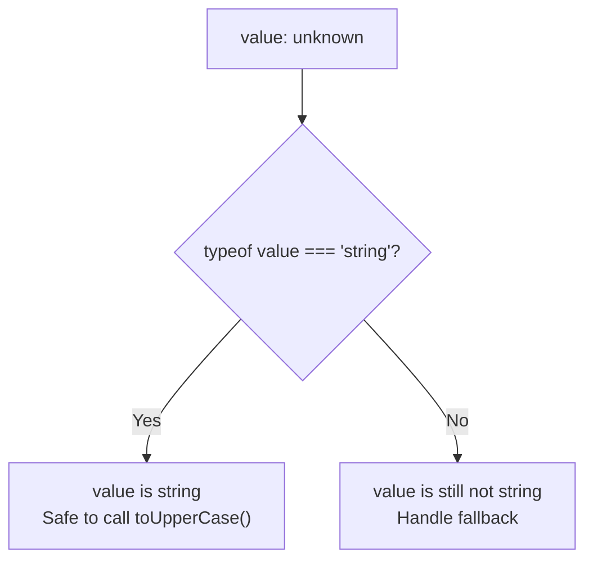
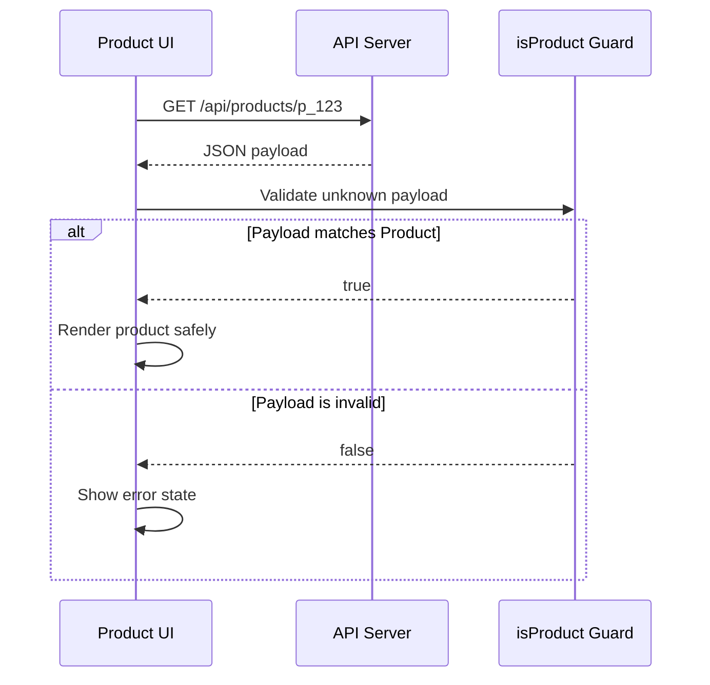
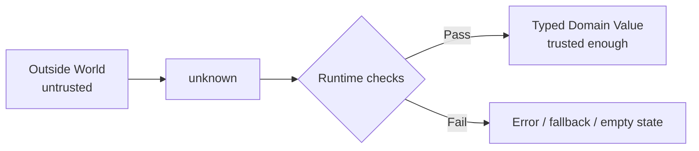

## Introduction: `unknown` Is Not the Enemy

When I first saw `unknown` in TypeScript, my honest reaction was: "Why would I ever write a type that says I do not know the type?" It felt like giving up. We use TypeScript because we want types, right? So why would a serious programmer intentionally write `unknown`?

After writing more real application code, especially code that talks to APIs, reads browser storage, handles form input, parses JSON, catches errors, and receives data from libraries, I started to appreciate `unknown` a lot more. `unknown` is not a way to avoid typing. It is a way to be honest at the boundary of your program.

The most important beginner idea is this:

> `unknown` means "I do not know what this value is yet, so TypeScript must not let me use it until I check it."

That sentence is the whole post in miniature. In JavaScript, values can come from anywhere. A backend response might change. A user might paste strange input. `localStorage` might contain old data from last month. A third-party SDK might return something different after an upgrade. `JSON.parse()` accepts a string and can create almost any shape. In those places, pretending we already know the exact type is risky.

`unknown` lets us slow down at those risky boundaries. It forces us to ask a small but powerful question before we use a value:

> "What proof do I have that this value has the shape I expect?"

That sounds strict, but in practice it makes beginner code easier to debug. Instead of finding a broken property access at runtime, TypeScript asks you to validate the value first. It turns hidden assumptions into visible code.

## 1. Why `unknown` Exists

TypeScript has a few types that often appear in beginner questions:

| Type | Beginner meaning | Can you use it directly? |
|---|---|---|
| `string` | Definitely text | Yes |
| `number` | Definitely a number | Yes |
| `boolean` | Definitely true or false | Yes |
| `object` | Some non-primitive object | Only object-level operations |
| `any` | TypeScript stops checking | Yes, dangerously |
| `unknown` | We need to inspect it first | No, not until narrowed |
| `never` | Should never happen | No value exists |

The type `unknown` was designed for values that cross a trust boundary. A trust boundary is any place where your code receives data it cannot fully control.

Examples:

- A response from `fetch()`
- A payload from `JSON.parse()`
- A message from `postMessage`
- A value from `localStorage`
- A plugin configuration file
- A caught error
- A callback argument from a third-party package
- A value passed into a generic utility

In these places, writing `any` is tempting because it lets you move fast. The problem is that `any` also removes TypeScript's help exactly where you need help most.

Here is the dangerous version:


```ts
const value: any = JSON.parse('{"name":"Ada"}');

// TypeScript allows this, but it may crash at runtime.
console.log(value.profile.avatar.url.toUpperCase());
```


Because `value` is `any`, TypeScript does not complain. It assumes you know what you are doing. But if `profile` does not exist, JavaScript throws an error.

Now compare `unknown`:


```ts
const value: unknown = JSON.parse('{"name":"Ada"}');

// TypeScript blocks this:
// console.log(value.profile.avatar.url.toUpperCase());
```


This can feel annoying at first, but TypeScript is doing something kind: it refuses to let an unverified value walk straight into your application logic.

## 2. `unknown` vs `any`: The Core Difference

`any` and `unknown` both can hold any value. The difference is what TypeScript allows you to do afterwards.

With `any`, TypeScript says:

> "Do whatever you want. I will not check."

With `unknown`, TypeScript says:

> "You can store it, pass it around, or compare it, but you must narrow it before using it as a specific type."

Look at this simple example:


```ts
let valueAny: any = "hello";
let valueUnknown: unknown = "hello";

// Allowed, but unsafe if valueAny changes later.
console.log(valueAny.toUpperCase());

// Not allowed yet:
// console.log(valueUnknown.toUpperCase());

if (typeof valueUnknown === "string") {
  // Now TypeScript knows valueUnknown is a string.
  console.log(valueUnknown.toUpperCase());
}
```


The `if` statement is called narrowing. Narrowing means TypeScript starts with a broad type, then uses your runtime checks to infer a more specific type.

Here is the flow:



`unknown` does not stop you from programming. It asks you to write the missing check.

## 3. What You Can and Cannot Do With `unknown`

You can assign anything to `unknown`:


```ts
let value: unknown;

value = "hello";
value = 42;
value = true;
value = null;
value = undefined;
value = { id: 1 };
value = ["a", "b"];
value = () => "done";
```


But you cannot use it as a specific type without checking:


```ts
let value: unknown = "hello";

// Not allowed:
// value.toUpperCase();
// value.length;
// value();
// value[0];
```


You can still do some very general operations:


```ts
function inspect(value: unknown) {
  console.log(value);

  if (value === null) {
    console.log("The value is null.");
  }

  if (value !== undefined) {
    console.log("The value is defined.");
  }
}
```


The rule is simple: TypeScript allows operations that are safe for all possible values. Calling `.toUpperCase()` is not safe for all possible values, because numbers, booleans, objects, and `null` do not have that method.

## 4. The Most Important Skill: Narrowing

Narrowing is the technique that turns `unknown` into a useful type.

##Example 1: `typeof` for primitive values


```ts
function formatLabel(value: unknown): string {
  if (typeof value === "string") {
    return value.trim();
  }

  if (typeof value === "number") {
    return value.toFixed(2);
  }

  if (typeof value === "boolean") {
    return value ? "Yes" : "No";
  }

  return "Unsupported value";
}

console.log(formatLabel("  Ada  ")); // "Ada"
console.log(formatLabel(3.14159));   // "3.14"
console.log(formatLabel(false));     // "No"
console.log(formatLabel({}));        // "Unsupported value"
```


This function is small, but it shows the heart of `unknown`: receive a broad value, check it, then handle each case.

##Example 2: `Array.isArray` for arrays


```ts
function getFirstString(value: unknown): string | undefined {
  if (!Array.isArray(value)) {
    return undefined;
  }

  const firstItem = value[0];

  if (typeof firstItem === "string") {
    return firstItem;
  }

  return undefined;
}

console.log(getFirstString(["TypeScript", "React"])); // "TypeScript"
console.log(getFirstString([123, 456]));              // undefined
console.log(getFirstString("not an array"));          // undefined
```


##Example 3: `instanceof` for classes


```ts
function getErrorMessage(error: unknown): string {
  if (error instanceof Error) {
    return error.message;
  }

  if (typeof error === "string") {
    return error;
  }

  return "Unknown error";
}
```


This pattern is especially useful in `catch` blocks. Modern TypeScript encourages treating caught errors as `unknown`, because JavaScript allows throwing anything:


```ts
throw new Error("Network failed");
throw "Network failed";
throw { code: "NETWORK_FAILED" };
throw 404;
```


##Example 4: Checking object shape

Object checks are the place where beginners usually need the most practice.


```ts
type User = {
  id: number;
  name: string;
};

function isUser(value: unknown): value is User {
  if (typeof value !== "object" || value === null) {
    return false;
  }

  return (
    "id" in value &&
    "name" in value &&
    typeof value.id === "number" &&
    typeof value.name === "string"
  );
}

function greet(value: unknown): string {
  if (!isUser(value)) {
    return "Hello, guest.";
  }

  return `Hello, ${value.name}. Your id is ${value.id}.`;
}
```


The return type `value is User` is called a type predicate. It tells TypeScript: "If this function returns true, you may treat `value` as `User`."

## 5. A Practical API Example

Let us build a realistic example. Imagine your frontend calls an API endpoint:


```ts
type Product = {
  id: string;
  name: string;
  price: number;
  inStock: boolean;
};
```


Your UI wants to render a product card. A beginner might write:


```ts
async function fetchProduct(id: string): Promise<Product> {
  const response = await fetch(`/api/products/${id}`);
  return response.json();
}
```


This compiles, but it is not as safe as it looks. `response.json()` returns a parsed value from the network. The network does not care about your TypeScript type. If the backend returns `{ "error": "not found" }`, your function still promises `Product`.

A safer version treats JSON as `unknown` first:


```ts
type Product = {
  id: string;
  name: string;
  price: number;
  inStock: boolean;
};

function isProduct(value: unknown): value is Product {
  if (typeof value !== "object" || value === null) {
    return false;
  }

  return (
    "id" in value &&
    "name" in value &&
    "price" in value &&
    "inStock" in value &&
    typeof value.id === "string" &&
    typeof value.name === "string" &&
    typeof value.price === "number" &&
    typeof value.inStock === "boolean"
  );
}

async function fetchProduct(id: string): Promise<Product> {
  const response = await fetch(`/api/products/${id}`);
  const data: unknown = await response.json();

  if (!isProduct(data)) {
    throw new Error("API returned an invalid product payload.");
  }

  return data;
}
```


This code has more lines, but the contract is much stronger. `fetchProduct()` only returns a `Product` after proving the payload is actually shaped like a `Product`.

Here is the data flow:



## 6. `unknown` Makes Bad Assumptions Visible

One of the biggest benefits of `unknown` is that it makes assumptions visible in code.

Consider this function:


```ts
function printUserName(user: any) {
  console.log(user.name.toUpperCase());
}
```


It has hidden assumptions:

- `user` is not `null`
- `user` is an object
- `user.name` exists
- `user.name` is a string

With `any`, none of those assumptions are written down. They only appear when the code crashes.

Now write it with `unknown`:


```ts
function printUserName(user: unknown) {
  if (typeof user !== "object" || user === null) {
    console.log("Invalid user.");
    return;
  }

  if (!("name" in user) || typeof user.name !== "string") {
    console.log("User has no valid name.");
    return;
  }

  console.log(user.name.toUpperCase());
}
```


The assumptions are now explicit. The code tells the next programmer exactly what it needs.

This is one of those small professional habits that makes a codebase calmer. Future you can read the function and understand its defensive boundary. A teammate can change the API and quickly see which validation rule needs updating.

## 7. A Beginner-Friendly Mental Model

I like this mental model:



Your app has an outside and an inside.

The outside world is messy. It includes network data, user input, files, plugins, browser APIs, and old cached state.

The inside of your app should be calmer. Components, services, reducers, and business logic should ideally work with known types. `unknown` is the small checkpoint between those two worlds.

This means you do not need to write `unknown` everywhere. In fact, writing `unknown` everywhere would make your code harder to use. Use `unknown` near boundaries. After validation, pass properly typed values through the rest of your app.

Good places for `unknown`:

- API client response parsing
- JSON parsing utilities
- Error handling helpers
- Message event handlers
- Public library APIs that accept user-provided data
- Validation functions

Less useful places for `unknown`:

- Internal component props you already control
- Local variables with obvious values
- Domain functions that should receive validated data
- Everywhere just to look strict

## 8. `unknown` in `catch` Blocks

Error handling is one of the best places to learn `unknown`.

In JavaScript, you can throw any value:


```ts
throw new Error("Something failed");
throw "Something failed";
throw { message: "Something failed" };
throw null;
```


So this code is risky:


```ts
try {
  await saveProfile();
} catch (error: any) {
  console.log(error.message);
}
```


If someone throws a string, `error.message` is `undefined`. If someone throws `null`, accessing `message` crashes.

A safer helper:


```ts
function getErrorMessage(error: unknown): string {
  if (error instanceof Error) {
    return error.message;
  }

  if (typeof error === "string") {
    return error;
  }

  if (
    typeof error === "object" &&
    error !== null &&
    "message" in error &&
    typeof error.message === "string"
  ) {
    return error.message;
  }

  return "Something went wrong.";
}

try {
  await saveProfile();
} catch (error) {
  console.log(getErrorMessage(error));
}
```


This is a very practical pattern. I often create a helper like this early in a TypeScript project because errors come from many places: HTTP clients, validation libraries, browser APIs, custom code, and legacy JavaScript.

## 9. Type Guards: Your Best Friend

A type guard is a function that checks a value at runtime and teaches TypeScript a type at compile time.

Here is a reusable guard:


```ts
function isRecord(value: unknown): value is Record<string, unknown> {
  return typeof value === "object" && value !== null && !Array.isArray(value);
}
```


`Record<string, unknown>` means "an object with string keys, where each value is still unknown." This is useful because after we know something is an object, we still should not pretend every property is safe.

Now we can build more specific guards:


```ts
type LoginResponse = {
  accessToken: string;
  expiresInSeconds: number;
};

function isLoginResponse(value: unknown): value is LoginResponse {
  if (!isRecord(value)) {
    return false;
  }

  return (
    typeof value.accessToken === "string" &&
    typeof value.expiresInSeconds === "number"
  );
}
```


This is cleaner than repeating the object check everywhere.

You can also create small helper guards:


```ts
function isString(value: unknown): value is string {
  return typeof value === "string";
}

function isNumber(value: unknown): value is number {
  return typeof value === "number" && Number.isFinite(value);
}

function isBoolean(value: unknown): value is boolean {
  return typeof value === "boolean";
}
```


Then compose them:


```ts
type FeatureFlag = {
  key: string;
  enabled: boolean;
  rolloutPercentage: number;
};

function isFeatureFlag(value: unknown): value is FeatureFlag {
  if (!isRecord(value)) {
    return false;
  }

  return (
    isString(value.key) &&
    isBoolean(value.enabled) &&
    isNumber(value.rolloutPercentage)
  );
}
```


This style is easy to test. You can write unit tests for invalid payloads and make sure your app fails gracefully instead of crashing.

## 10. Validating Nested Objects

Real data is rarely flat. Let us validate a nested profile object.


```ts
type Profile = {
  id: string;
  displayName: string;
  settings: {
    theme: "light" | "dark";
    emailNotifications: boolean;
  };
};
```


The guard:


```ts
function isRecord(value: unknown): value is Record<string, unknown> {
  return typeof value === "object" && value !== null && !Array.isArray(value);
}

function isTheme(value: unknown): value is "light" | "dark" {
  return value === "light" || value === "dark";
}

function isProfile(value: unknown): value is Profile {
  if (!isRecord(value)) {
    return false;
  }

  if (!isRecord(value.settings)) {
    return false;
  }

  return (
    typeof value.id === "string" &&
    typeof value.displayName === "string" &&
    isTheme(value.settings.theme) &&
    typeof value.settings.emailNotifications === "boolean"
  );
}
```


Notice how every layer is checked. We do not access `value.settings.theme` until we know `value.settings` is a record.

This order matters. If you write checks in the wrong order, your guard can crash while trying to validate bad data. A validator should be boring and reliable. It should not throw unless you intentionally design it to throw.

## 11. Arrays of Unknown Values

API responses often return arrays. An array itself can be valid, but its items can still be invalid.


```ts
type Todo = {
  id: number;
  title: string;
  completed: boolean;
};

function isTodo(value: unknown): value is Todo {
  if (typeof value !== "object" || value === null) {
    return false;
  }

  return (
    "id" in value &&
    "title" in value &&
    "completed" in value &&
    typeof value.id === "number" &&
    typeof value.title === "string" &&
    typeof value.completed === "boolean"
  );
}

function isTodoArray(value: unknown): value is Todo[] {
  return Array.isArray(value) && value.every(isTodo);
}
```


Now use it:


```ts
async function fetchTodos(): Promise<Todo[]> {
  const response = await fetch("/api/todos");
  const data: unknown = await response.json();

  if (!isTodoArray(data)) {
    throw new Error("Invalid todos payload.");
  }

  return data;
}
```


This prevents a common bug: assuming an API returned `Todo[]` when it actually returned an error object, a partial array, or an array with one broken item.

## 12. `unknown` With Generics

Generics are another area where `unknown` is useful.

Imagine a storage helper:


```ts
function readJson<T>(key: string): T | null {
  const raw = localStorage.getItem(key);

  if (raw === null) {
    return null;
  }

  return JSON.parse(raw) as T;
}
```


This looks convenient:


```ts
const profile = readJson<Profile>("profile");
```


But it has the same problem: `as T` does not validate. It only asserts.

A safer design asks the caller for a guard:


```ts
function readJson<T>(
  key: string,
  isValid: (value: unknown) => value is T
): T | null {
  const raw = localStorage.getItem(key);

  if (raw === null) {
    return null;
  }

  let parsed: unknown;

  try {
    parsed = JSON.parse(raw);
  } catch {
    return null;
  }

  if (!isValid(parsed)) {
    return null;
  }

  return parsed;
}

const profile = readJson("profile", isProfile);
```


This version is a little more verbose, but it is honest. The generic type `T` is only returned after runtime validation.

## 13. `as` Assertions vs `unknown`

Type assertions are not evil. Sometimes you need them. But beginners often use `as` as an escape hatch.


```ts
const data = JSON.parse(raw) as User;
```


This says: "Treat `data` as `User`." It does not say: "Check whether `data` is `User`."

A useful rule:

> Use `as` when you know something TypeScript cannot know. Use `unknown` plus validation when neither you nor TypeScript can safely know yet.

For example, DOM APIs sometimes need assertions because you control the HTML:


```ts
const input = document.querySelector("#email") as HTMLInputElement | null;
```


Even here, a runtime check is often better:


```ts
const element = document.querySelector("#email");

if (element instanceof HTMLInputElement) {
  console.log(element.value);
}
```


The more external and unstable the data is, the more you should prefer validation over assertion.

## 14. A Mini Project: Safe Settings Loader

Let us build a small but realistic settings loader. The goal is to load settings from `localStorage`, validate them, and fall back to defaults if invalid.

##Step 1: Define the domain type


```ts
type AppSettings = {
  theme: "light" | "dark";
  fontSize: number;
  compactMode: boolean;
};

const defaultSettings: AppSettings = {
  theme: "light",
  fontSize: 16,
  compactMode: false,
};
```


##Step 2: Write the guard


```ts
function isRecord(value: unknown): value is Record<string, unknown> {
  return typeof value === "object" && value !== null && !Array.isArray(value);
}

function isTheme(value: unknown): value is AppSettings["theme"] {
  return value === "light" || value === "dark";
}

function isAppSettings(value: unknown): value is AppSettings {
  if (!isRecord(value)) {
    return false;
  }

  return (
    isTheme(value.theme) &&
    typeof value.fontSize === "number" &&
    Number.isFinite(value.fontSize) &&
    value.fontSize >= 12 &&
    value.fontSize <= 24 &&
    typeof value.compactMode === "boolean"
  );
}
```


##Step 3: Load safely


```ts
function loadSettings(): AppSettings {
  const raw = localStorage.getItem("app-settings");

  if (raw === null) {
    return defaultSettings;
  }

  let parsed: unknown;

  try {
    parsed = JSON.parse(raw);
  } catch {
    return defaultSettings;
  }

  if (!isAppSettings(parsed)) {
    return defaultSettings;
  }

  return parsed;
}
```


##Step 4: Save safely


```ts
function saveSettings(settings: AppSettings): void {
  localStorage.setItem("app-settings", JSON.stringify(settings));
}
```


Notice the shape of the system:

- Loading from storage uses `unknown`
- Validation converts `unknown` into `AppSettings`
- Saving accepts only `AppSettings`
- The rest of the app does not need to worry about invalid settings

This is a clean boundary. Once `loadSettings()` returns, your UI can trust the result.

## 15. Using a Validation Library

For small examples, handwritten guards are fine. For large applications, schema validation libraries can reduce repetitive code. Popular options include Zod, Valibot, io-ts, and similar tools.

Here is the idea with a schema-based approach:


```ts
import { z } from "zod";

const ProductSchema = z.object({
  id: z.string(),
  name: z.string(),
  price: z.number(),
  inStock: z.boolean(),
});

type Product = z.infer<typeof ProductSchema>;

async function fetchProduct(id: string): Promise<Product> {
  const response = await fetch(`/api/products/${id}`);
  const data: unknown = await response.json();

  return ProductSchema.parse(data);
}
```


The important part is still `unknown`. The schema receives an unknown value and validates it. If valid, it returns a typed `Product`. If invalid, it throws or returns a structured error depending on the API you use.

For beginners, I recommend learning handwritten guards first. Not because libraries are bad, but because manual guards teach the underlying mental model. Once you understand the model, libraries feel like convenient tools instead of magic.

## 16. Common Beginner Mistakes

##Mistake 1: Replacing all `any` with `unknown` without narrowing

This often happens after someone reads "avoid any." They replace `any` with `unknown`, then the project lights up with errors.

The fix is not to fight TypeScript. The fix is to add the missing checks.

##Mistake 2: Using `unknown` for values already known

Do not write this:


```ts
const count: unknown = 3;
```


If you know it is a number, write:


```ts
const count = 3;
```


Use `unknown` when the value is genuinely uncertain.

##Mistake 3: Validating too late

If invalid data travels deep into your app before validation, many functions must handle uncertainty. Validate near the boundary.

Bad:


```ts
const data: unknown = await response.json();
renderProductPage(data);
```


Better:


```ts
const data: unknown = await response.json();

if (!isProduct(data)) {
  showError();
  return;
}

renderProductPage(data);
```


##Mistake 4: Trusting object existence but not property types

This check is incomplete:


```ts
function isUser(value: unknown): value is User {
  return typeof value === "object" && value !== null && "name" in value;
}
```


It only proves `name` exists. It does not prove `name` is a string.

Better:


```ts
function isUser(value: unknown): value is User {
  return (
    typeof value === "object" &&
    value !== null &&
    "name" in value &&
    typeof value.name === "string"
  );
}
```


## 17. When `unknown` Improves Team Communication

TypeScript is not only for computers. It is also a communication tool for humans.

When a teammate sees this:


```ts
function normalizeWebhookPayload(payload: unknown): WebhookEvent {
  // validation here
}
```


They immediately understand that the function expects untrusted input and will normalize it.

When they see this:


```ts
function sendWelcomeEmail(user: User): Promise<void> {
  // business logic here
}
```


They understand that `user` should already be validated before reaching this function.

That difference is design. `unknown` marks the outside edge. Specific domain types mark the inside of your application.

## 18. Practice Exercises

If you are new to `unknown`, try these exercises. They are small enough to finish in one sitting, but useful enough to appear in real projects.

##Exercise 1: Safe string parser

Write a function:


```ts
function parseDisplayName(value: unknown): string {
  // Return trimmed string if value is a non-empty string.
  // Otherwise return "Anonymous".
}
```


Possible solution:


```ts
function parseDisplayName(value: unknown): string {
  if (typeof value !== "string") {
    return "Anonymous";
  }

  const trimmed = value.trim();
  return trimmed.length > 0 ? trimmed : "Anonymous";
}
```


##Exercise 2: Safe number parser

Write a function that accepts `unknown` and returns a valid page number.


```ts
function parsePage(value: unknown): number {
  if (typeof value !== "number") {
    return 1;
  }

  if (!Number.isInteger(value) || value < 1) {
    return 1;
  }

  return value;
}
```


##Exercise 3: Safe user array

Write a guard:


```ts
type User = {
  id: string;
  name: string;
};

function isUserArray(value: unknown): value is User[] {
  // Your code here
}
```


Possible solution:


```ts
function isUser(value: unknown): value is User {
  return (
    typeof value === "object" &&
    value !== null &&
    "id" in value &&
    "name" in value &&
    typeof value.id === "string" &&
    typeof value.name === "string"
  );
}

function isUserArray(value: unknown): value is User[] {
  return Array.isArray(value) && value.every(isUser);
}
```


## 19. A Practical Checklist

When you see a value from outside your code, use this checklist:

| Question | Why it matters |
|---|---|
| Did this value come from outside my app? | If yes, consider `unknown`. |
| Do I have runtime proof of its shape? | TypeScript types alone do not validate runtime data. |
| Can invalid data reach business logic? | Validate earlier if possible. |
| What should happen when validation fails? | Decide between fallback, error state, logging, or throwing. |
| Should this check be reusable? | If yes, create a type guard or schema. |

## 20. Final Thoughts: `unknown` Teaches Professional Caution

The best thing about `unknown` is not the keyword itself. The best thing is the habit it teaches.

It teaches you to separate untrusted input from trusted domain values. It teaches you to validate near the boundary. It teaches you to make assumptions visible. It teaches you to handle failure deliberately instead of accidentally.

For a newbie programmer, this is a big step. Many beginners think programming is mainly about making the happy path work. Real programming is also about understanding where the happy path can break, then designing the code so the break is understandable, recoverable, and not surprising.

So when you see `unknown`, do not think:

> "TypeScript is making my life harder."

Think:

> "TypeScript is asking me what proof I have."

That question is valuable. Answer it with a guard, a schema, a fallback, or a clear error. Once you get used to that rhythm, `unknown` becomes less like a wall and more like a useful checkpoint.


---

## `unknown` 唔係阻住你，係幫你守門口

好多新手見到 `unknown` 會覺得好怪："我用 TypeScript 就係想知 type，點解而家寫個 `unknown` 話唔知？" 呢個反應好正常。

但寫多啲真實 project 之後，你會發現好多資料其實一開始真係唔可信。API response、`JSON.parse()`、`localStorage`、URL query string、form input、第三方 library callback、甚至 `catch (error)` 入面嘅 error，都唔係你可以盲信嘅東西。

`unknown` 嘅意思唔係 "我放棄 type safety"。相反，佢係話：

> "呢個 value 我暫時唔知係咩，所以用之前一定要 check 清楚。"

`unknown` 好似公司門口個保安。佢唔係唔畀人入，而係要求每個人先出示證件。證件啱，就可以入；證件唔啱，就唔好扮熟。

---

## `unknown` 存在係因為真實世界啲資料唔一定聽話

新手寫 demo 時，資料通常好乾淨：


```ts
const user = {
  id: 1,
  name: "Ada"
};
```


但真實 app 入面，資料好多時係咁嚟：


```ts
const user = JSON.parse(localStorage.getItem("user") ?? "null");
```


你以為 `user.name` 一定係 string，但實際上可能係：

- `null`
- 舊版本 schema
- user 手動改咗 browser storage
- API bug
- network proxy 回咗奇怪 payload
- testing mock 寫錯咗

所以 `unknown` 係叫你停一停，先 check，再用。佢幫你將 "我以為" 變成 "我已經驗證過"。

---

## `any` 係放行，`unknown` 係先驗證

`any` 同 `unknown` 都可以放任何 value，但分別好大：

| Type | 你可以點用 | 風險 |
|---|---|---|
| `any` | 直接用，TypeScript 幾乎唔理 | 好容易將 bug 帶入 runtime |
| `unknown` | 要 check 完先可以用 | 多一步，但安全好多 |

可以咁理解：

- `any`：朋友話 "信我啦"，你就畀佢直接入 production。
- `unknown`：朋友話 "信我啦"，你答 "得，先畀我睇吓證明。"

寫 production code，我會偏向第二個。因為 bug 最麻煩唔係出現，而係太遲先出現。

---

## `unknown` 可以收任何 value，但唔可以亂用

你可以將任何 value 放入 `unknown`，但用之前要 check。呢個設計好合理，因為 `unknown` 本身就係話 "暫時未知"。

新手可以記住呢句：

> 放入去容易，拎出嚟要驗證。

呢個習慣好重要。好多 runtime bug 其實都係 "拎出嚟嗰刻無驗證" 造成。

---

## Narrowing 就係由 "唔知" 變成 "知"

`unknown` 真正好用嘅地方，就係配合 narrowing。

你可以用：

- `typeof` check primitive，例如 `string`、`number`、`boolean`
- `Array.isArray()` check array
- `instanceof` check class instance，例如 `Error`
- 自己寫 type guard check object shape

個思路係：

1. 一開始 `value` 係 `unknown`
2. 用 runtime check 證明佢係某個 type
3. TypeScript 喺 check 通過之後，就畀你安全使用

呢個過程好似過關。未過關之前，唔可以亂攞 privilege；過咗關，就可以用相應能力。

---

## API response 最應該用 `unknown`

好多新手會以為：


```ts
const data: Product = await response.json();
```


咁就安全。其實呢句只係你話畀 TypeScript 聽 "相信我，佢係 Product"。但 TypeScript 無真正見過 network response。backend 回錯、mock 錯、schema 變咗，TypeScript compile time 係唔會知道。

所以更安全係：


```ts
const data: unknown = await response.json();
```


然後用 `isProduct(data)` 去 check。呢個習慣可以幫你將 API boundary 守得好好多。尤其係公司 project，frontend 同 backend 經常係唔同人寫，大家對 schema 嘅理解未必永遠同步。

---

## `unknown` 迫你寫低你嘅假設

`any` 最大問題係太順手。順手到你唔記得自己其實做緊好多假設。

例如：


```ts
user.name.toUpperCase()
```


呢一行背後其實有幾個假設：

- `user` 唔係 `null`
- `user` 係 object
- `name` 存在
- `name` 係 string

用 `unknown`，你要逐個 check。初初會覺得煩，但大 project 入面，呢啲 check 就係文檔，亦都係保護網。

---

## 唔係成個 app 都要 `unknown`

`unknown` 最適合放喺 boundary，即係資料由外面入嚟嘅地方。

例如：

- API response 入嚟
- `JSON.parse()` 出嚟
- `localStorage` 讀出嚟
- URL query string 解析出嚟
- 第三方 SDK call 返你
- `catch (error)` 捉到 error

但如果資料已經入咗你嘅 domain layer，而且已經 validate 過，你就唔需要一路保持 `unknown`。否則你會搞到自己每行都要 check，好辛苦。

一個健康 pattern 係：

1. Boundary 用 `unknown`
2. Validate
3. 轉成 domain type
4. App 內部用清楚嘅 type

---

## `catch (error)` 真係應該當 `unknown`

好多新手以為 `catch` 入面嘅 `error` 一定係 `Error` object。但 JavaScript 無咁保證。

所以你唔應該一嚟就：


```ts
error.message
```


比較穩陣係整個 `getErrorMessage(error: unknown)` helper。之後成個 project 都用同一套方法處理 error，UI 顯示會穩定好多，log 亦清楚好多。

---

## Type guard 係 `unknown` 嘅拍檔

如果你成日喺不同地方寫同一堆 check，code 會好亂。所以最好整 type guard。

例如：


```ts
function isUser(value: unknown): value is User {
  // check...
}
```


`value is User` 呢句好重要。佢唔單止 return `boolean`，仲係同 TypeScript 講：

> 如果我 return true，呢個 value 就可以當 User 用。

呢個係 runtime 同 compile time 之間嘅橋。runtime 負責真實 check，TypeScript 負責之後嘅 type inference。

---

## Nested object 要逐層 check

Nested object 最常見錯誤係太快跳入去：


```ts
value.settings.theme
```


如果 `settings` 根本唔存在，呢行就會爆。所以要逐層：

1. `value` 係咪 object？
2. `settings` 係咪 object？
3. `theme` 係咪 `"light"` 或 `"dark"`？
4. `emailNotifications` 係咪 boolean？

呢啲 check 睇落細碎，但佢哋將 runtime crash 變成可控嘅 invalid payload。

---

## Array check 唔止 check 佢係咪 array

好多時新手會寫：


```ts
if (Array.isArray(data)) {
  // assume Todo[]
}
```


但 `Array.isArray(data)` 只係證明 `data` 係 array，唔代表入面每個 item 都係 `Todo`。

所以要：


```ts
Array.isArray(data) && data.every(isTodo)
```


咁先係真正 check 成個 `Todo[]`。

---

## Generic 唔等於自動 validate

`readJson<Profile>()` 好似好靚，但要記住：TypeScript generic 只喺 compile time 存在。到咗 runtime，JavaScript 唔知道 `Profile` 係咩。

所以呢句：


```ts
JSON.parse(raw) as T
```


唔係驗證，只係你叫 TypeScript 相信你。

如果資料來源唔可信，最好傳入 guard：


```ts
readJson("profile", isProfile)
```


咁你嘅 generic helper 先真正安全。

---

## `as` 唔係驗證，係你自己拍心口

`as User` 好似幫你變咗 type，但其實只係同 TypeScript 講："信我啦。"

如果你真係控制到個 value，例如某啲 DOM 結構係你自己寫，短短用 `as` 未必係大問題。但如果係 API response、storage、JSON，最好唔好一嘢 `as` 落去。

記住：

- `as`：我知道，但 TypeScript 唔知道
- `unknown` + guard：我都未完全知道，所以要 check

---

## 一個完整小例子點樣用 `unknown`

呢個 settings loader 展示咗一個好實用嘅 pattern：

1. `localStorage` 讀出嚟係外部資料，所以當 `unknown`
2. `JSON.parse()` 可能 fail，所以用 `try/catch`
3. parse 完都未可信，所以用 `isAppSettings`
4. invalid 就 fallback 去 default
5. app 內部只處理 `AppSettings`

呢個 pattern 好適合新手練習，因為你會一次過學到 `unknown`、type guard、fallback、domain type 幾個重要概念。

---

## Library 可以幫手，但先理解原理

Zod 呢類 library 好好用，尤其係 project 大咗之後。但新手唔好一開始就只記 library syntax，而唔明背後發生咩事。

核心仍然係：


```ts
const data: unknown = await response.json();
```


然後用 schema parse。schema 做嘅事，本質上就係 runtime validation。你明咗 type guard，就會明 schema library 點解有用。

---

## 新手常見錯誤

第一，唔好機械式將所有 `any` 改做 `unknown`，然後唔加 check。`unknown` 係要配合 narrowing。

第二，已經知道嘅 value 唔需要 `unknown`。你自己寫死 `const count = 3`，TypeScript 已經知佢係 number。

第三，validation 要早做。越早將 `unknown` 變成 domain type，後面 code 越乾淨。

第四，check object 唔等於 check property type。`"name" in value` 只係證明有 `name`，唔代表 `name` 係 string。

---

## `unknown` 係團隊溝通訊號

一個 function 收 `unknown`，其實係同隊友講：

> 呢度係 boundary，我會負責 validate。

一個 function 收 `User`，就係講：

> 請傳入已經 validate 好嘅 user。

呢啲 type signature 會令 codebase 清楚好多。新同事睇 code 時，會知道邊度係入口、邊度係 business logic、邊度應該處理 invalid data。

---

##中文練習：由細例子開始

如果你係新手，唔好一開始就挑戰好複雜 schema。先練：

- `unknown` 變 `string`
- `unknown` 變 `number`
- `unknown` 變 simple object
- `unknown` 變 array of object

每次練習都問自己：

1. 呢個 value 最初可信嗎？
2. 我要證明啲咩？
3. 如果 invalid，我想 throw error、return default，定 show error state？

呢三條問題已經可以幫你寫出好穩陣嘅 TypeScript。

---

## Checklist

見到外來資料，可以問：

| 問題 | 意義 |
|---|---|
| 呢個 value 係咪由 app 外面嚟？ | 係嘅話，考慮用 `unknown`。 |
| 我有冇 runtime proof？ | TypeScript type 唔會自動 validate JSON。 |
| invalid data 會唔會入到 business logic？ | 會嘅話，validation 太遲。 |
| fail 咗要點處理？ | fallback、error UI、log、throw，要揀清楚。 |
| 呢個 check 會唔會重用？ | 會嘅話，整 type guard 或 schema。 |

---

## 總結：`unknown` 幫你由新手思維升級

`unknown` 唔係叫你寫多啲無謂 code。佢係訓練你：

- 分清楚外部資料同內部 domain value
- 喺 boundary 盡早 validate
- 將假設寫成明確 code
- invalid data 出現時有計劃咁處理
- 少啲 runtime surprise

新手最容易只顧 happy path。但真實 programmer 要諗埋資料唔啱、API 變咗、storage 壞咗、error 唔係 `Error` object 嗰啲情況。

所以，之後你見到：


```ts
const data: unknown = await response.json();
```


唔好覺得佢煩。佢其實係一個提醒：

> 未證明之前，唔好扮知。

呢個提醒，對寫穩陣 TypeScript 好有用。
